# Design Document: AETHER Elderly Care System

## Overview

AETHER (Autonomous Elderly Ecosystem for Total Health Emergency Response & Optimization) is a comprehensive voice-first, privacy-preserving healthcare AI system designed to monitor elderly individuals living independently. The system addresses critical safety challenges through multi-sensor fusion, edge-based processing, and intelligent AI assistance while maintaining dignity and privacy.

### System Purpose

The system provides continuous health monitoring and emergency response capabilities for elderly individuals across multiple deployment scenarios:
- B2C single home deployments (1-4 residents)
- B2B clinic operations (10-100 homes, 50-200 residents)
- B2B assisted living facilities (50-200 residents)
- B2B home nursing networks (100+ patients)

### Key Design Principles

1. **Privacy-First Architecture**: Edge-based processing with feature extraction (not raw audio/video by default)
2. **Offline-First Operations**: Core safety features work without internet connectivity
3. **Multi-Sensor Fusion**: Combine wearable IMU, pose estimation, and acoustic signals for high-confidence event detection
4. **Voice-First Interaction**: Natural language interface with wake-word detection and multi-language support
5. **Fail-Safe Defaults**: System failures result in alert escalation rather than silence
6. **Hybrid Cloud-Edge**: AWS primary infrastructure with NVIDIA edge acceleration for advanced use cases

### Technology Stack

**AWS Services (Primary Infrastructure)**:
- AWS Bedrock: LLM services (Nemotron, MedGemma, Gemma) with Guardrails
- AWS IoT Core: Device management and MQTT communication
- AWS SageMaker: Model training with federated learning
- AWS Lambda: Serverless event processing
- Amazon DynamoDB: Event storage and Timeline data
- Amazon S3: Evidence packets and model artifacts
- AWS Transcribe/Polly: Speech recognition and synthesis
- Amazon Kinesis: Real-time sensor data streaming
- AWS CloudWatch: Monitoring and logging
- AWS KMS: Encryption key management
- AWS Cognito: Authentication and user management
- Amazon Q: Intelligent care navigation assistance

**NVIDIA Technologies (Advanced Use Cases)**:
- Jetson Orin Nano: Edge GPU acceleration (optional upgrade from Raspberry Pi 5)
- DeepStream: Multi-camera pose estimation
- Triton Server: Multi-model serving on edge
- NVIDIA Riva: Edge-based ASR/TTS (alternative to AWS Transcribe/Polly)
- NVIDIA NIM: Optimized model deployment
- TAO Toolkit: Custom vision model training
- Omniverse: 3D simulation and digital twin


## Architecture

### System Architecture Overview

The AETHER system follows a three-tier architecture: Edge Layer, Cloud Layer, and Client Layer.

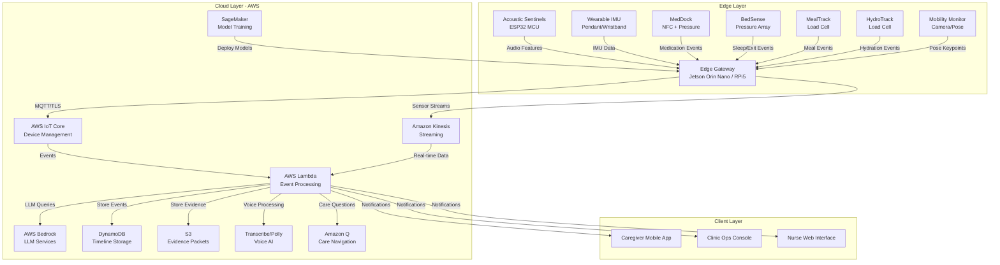

### Edge Layer Architecture

The Edge Gateway serves as the local processing hub, running on either Jetson Orin Nano (GPU-accelerated) or Raspberry Pi 5 (CPU-based).

**Key Responsibilities**:
- Multi-sensor data fusion for fall detection
- Privacy filtering (feature extraction, not raw data)
- Local voice processing (wake-word, ASR, TTS)
- Offline-capable event detection
- MQTT broker for sensor mesh
- Local model inference (fall detection, AED, pose estimation)
- Event queue for offline resilience

**Processing Pipeline**:
1. Sensor data arrives via MQTT from SenseMesh nodes
2. Privacy layer extracts features (audio spectral features, pose keypoints)
3. Fusion engine combines signals with confidence scoring
4. Event detector generates structured events
5. Escalation logic determines response tier
6. Events queued locally and transmitted to cloud when available


### Cloud Layer Architecture

The cloud layer provides scalable processing, storage, and AI services using AWS infrastructure.

**Event Processing Flow**:
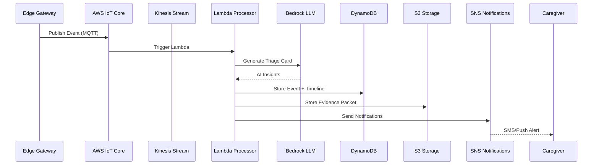

**Data Flow Patterns**:
1. **Real-time Events**: IoT Core → Lambda → DynamoDB/S3 → Notifications
2. **Streaming Sensor Data**: Kinesis → Lambda → Timestream → Analytics
3. **Voice Interactions**: Transcribe → Bedrock → Polly → Edge Gateway
4. **Care Navigation**: Amazon Q + Bedrock Knowledge Bases → RAG responses
5. **Model Training**: S3 (data) → SageMaker → Model Registry → Edge deployment

### Hybrid NVIDIA-AWS Integration

The system supports flexible deployment with intelligent routing between edge and cloud processing.

**Model Router Logic**:
- **High confidence, low latency required**: Edge inference (Triton/NIM on Jetson)
- **Complex reasoning, cloud available**: AWS Bedrock
- **Cloud unavailable**: Fallback to local models (Gemma on edge)
- **Voice processing**: NVIDIA Riva (edge) or AWS Transcribe/Polly (cloud)

**Deployment Modes**:
1. **Cloud-Primary**: Raspberry Pi 5 edge + AWS services (cost-optimized)
2. **Edge-Accelerated**: Jetson Orin Nano + NVIDIA stack + AWS backup (performance-optimized)
3. **Hybrid**: Dynamic routing based on connectivity, latency, and cost

### Privacy Architecture

**Privacy-Preserving Design**:
- Audio: Extract spectral features (MFCC, mel-spectrogram) on Acoustic Sentinel MCU, transmit features only
- Video: Extract pose keypoints (17-point skeleton) on Edge Gateway, discard frames
- Wearable: Transmit IMU features (acceleration patterns, orientation) not raw samples
- Default: No raw audio/video transmission to cloud
- Opt-in: Raw audio recording requires explicit consent with clear indicators

**Data Minimization**:
- Edge Gateway filters data before cloud transmission
- Only events and aggregated features leave the home
- Retention windows configurable (30/90/365/2555 days)
- Export and delete requests supported (GDPR/HIPAA compliance)


## Detailed AWS Architecture

### API Gateway Architecture

**Purpose**: Provide secure, scalable REST and WebSocket APIs for client applications.

**API Gateway Configuration**:
```yaml
APIs:
  REST_API:
    name: aether-api
    endpoint_type: REGIONAL
    authentication: AWS_IAM, Cognito
    throttling:
      rate_limit: 10000 requests/second
      burst_limit: 5000 requests
    
  WebSocket_API:
    name: aether-realtime
    route_selection: $request.body.action
    authentication: Cognito
    connection_timeout: 10 minutes
```

**API Endpoints**:

**REST API Endpoints**:
- `POST /events` - Submit event from Edge Gateway
- `GET /timeline/{home_id}` - Retrieve timeline for home
- `GET /residents/{resident_id}` - Get resident profile
- `PUT /residents/{resident_id}` - Update resident profile
- `POST /alerts/acknowledge` - Acknowledge alert
- `GET /evidence/{packet_id}` - Retrieve evidence packet
- `POST /care-navigation/query` - Submit care navigation question
- `GET /analytics/dashboard` - Get clinic operations metrics

**WebSocket API Routes**:
- `$connect` - Establish WebSocket connection
- `$disconnect` - Close WebSocket connection
- `subscribe` - Subscribe to real-time events for home
- `unsubscribe` - Unsubscribe from events
- `ping` - Keep-alive heartbeat

**API Gateway Integration**:
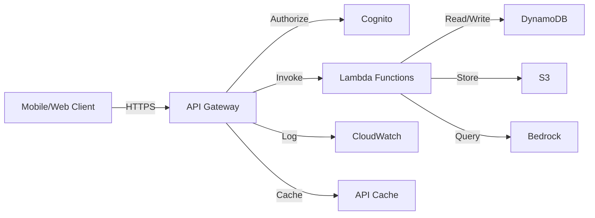

**Security Configuration**:
- TLS 1.3 for all connections
- AWS WAF rules for DDoS protection, SQL injection, XSS
- Request validation against OpenAPI schema
- Rate limiting per API key (1000 req/min for B2C, 10000 req/min for B2B)
- CORS configuration for web clients
- API keys for Edge Gateway authentication
- JWT tokens from Cognito for user authentication

**Caching Strategy**:
- Timeline queries: 60 second cache TTL
- Resident profiles: 300 second cache TTL
- Analytics dashboards: 120 second cache TTL
- Evidence packets: No caching (always fresh)
- Cache invalidation on data updates via Lambda


### Lambda Function Architecture

**Purpose**: Serverless compute for event processing, business logic, and integrations.

**Lambda Function Inventory**:

**1. Event Processor (`event-processor`)**
- **Trigger**: AWS IoT Core rule, Kinesis stream
- **Runtime**: Python 3.11
- **Memory**: 512 MB
- **Timeout**: 30 seconds
- **Concurrency**: 1000 reserved
- **Purpose**: Process incoming events, generate triage cards, store in DynamoDB
- **Environment Variables**: `BEDROCK_MODEL_ID`, `DYNAMODB_TABLE`, `S3_BUCKET`

**2. Escalation Handler (`escalation-handler`)**
- **Trigger**: Step Functions, EventBridge
- **Runtime**: Python 3.11
- **Memory**: 256 MB
- **Timeout**: 60 seconds
- **Concurrency**: 500 reserved
- **Purpose**: Execute escalation ladder, send notifications via SNS/SES
- **Environment Variables**: `SNS_TOPIC_ARN`, `TWILIO_API_KEY`

**3. Timeline Aggregator (`timeline-aggregator`)**
- **Trigger**: EventBridge (hourly), API Gateway
- **Runtime**: Python 3.11
- **Memory**: 1024 MB
- **Timeout**: 120 seconds
- **Concurrency**: 100 reserved
- **Purpose**: Aggregate events into daily timeline summaries
- **Environment Variables**: `DYNAMODB_TABLE`, `BEDROCK_MODEL_ID`

**4. Care Navigation (`care-navigation`)**
- **Trigger**: API Gateway
- **Runtime**: Python 3.11
- **Memory**: 512 MB
- **Timeout**: 30 seconds
- **Concurrency**: 500 reserved
- **Purpose**: Process care navigation queries using Amazon Q and Bedrock
- **Environment Variables**: `BEDROCK_KB_ID`, `AMAZON_Q_APP_ID`

**5. Voice Processor (`voice-processor`)**
- **Trigger**: API Gateway, S3 (audio upload)
- **Runtime**: Python 3.11
- **Memory**: 1024 MB
- **Timeout**: 60 seconds
- **Concurrency**: 200 reserved
- **Purpose**: Process voice commands using Transcribe, generate responses with Bedrock, synthesize with Polly
- **Environment Variables**: `TRANSCRIBE_LANGUAGE`, `POLLY_VOICE_ID`

**6. Documentation Generator (`doc-generator`)**
- **Trigger**: EventBridge (daily), API Gateway
- **Runtime**: Python 3.11
- **Memory**: 1024 MB
- **Timeout**: 300 seconds
- **Concurrency**: 50 reserved
- **Purpose**: Generate SOAP-like documentation from timeline events
- **Environment Variables**: `BEDROCK_MODEL_ID`, `S3_BUCKET`

**7. Model Deployer (`model-deployer`)**
- **Trigger**: S3 (model artifact upload), EventBridge
- **Runtime**: Python 3.11
- **Memory**: 512 MB
- **Timeout**: 300 seconds
- **Concurrency**: 10 reserved
- **Purpose**: Deploy trained models to Edge Gateways via IoT Core
- **Environment Variables**: `IOT_THING_GROUP`, `S3_MODEL_BUCKET`

**8. Analytics Processor (`analytics-processor`)**
- **Trigger**: Kinesis stream, EventBridge (hourly)
- **Runtime**: Python 3.11
- **Memory**: 2048 MB
- **Timeout**: 300 seconds
- **Concurrency**: 50 reserved
- **Purpose**: Generate clinic operations metrics, SLA reports
- **Environment Variables**: `TIMESTREAM_DATABASE`, `DYNAMODB_TABLE`

**Lambda Execution Flow**:
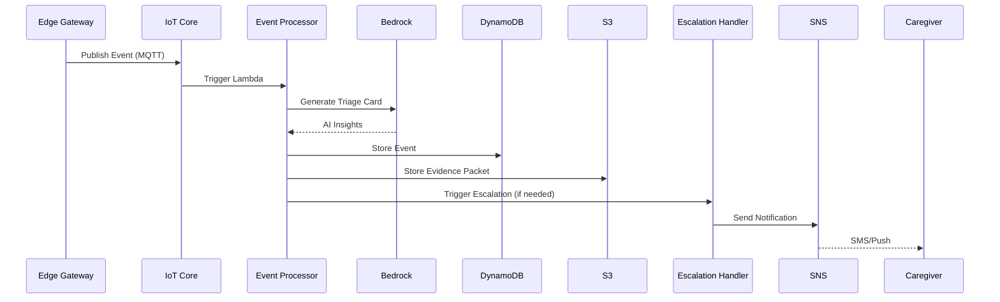

**Lambda Best Practices**:
- Use Lambda Layers for shared dependencies (boto3, requests, numpy)
- Implement exponential backoff for retries (3 attempts: 1s, 2s, 4s)
- Use dead-letter queues (SQS) for failed invocations
- Enable X-Ray tracing for distributed debugging
- Use environment variables for configuration (no hardcoded values)
- Implement structured logging with correlation IDs
- Use VPC endpoints for private subnet access to AWS services
- Implement circuit breakers for external API calls


### DynamoDB Architecture

**Purpose**: Scalable NoSQL database for events, timelines, profiles, and operational data.

**Table Design**:

**1. Events Table (`aether-events`)**
```yaml
Table:
  name: aether-events
  billing_mode: PAY_PER_REQUEST  # Auto-scaling
  
Primary_Key:
  partition_key: home_id (String)
  sort_key: timestamp (Number)  # Unix epoch milliseconds
  
Global_Secondary_Indexes:
  - name: event-type-index
    partition_key: event_type (String)
    sort_key: timestamp (Number)
    projection: ALL
    
  - name: resident-index
    partition_key: resident_id (String)
    sort_key: timestamp (Number)
    projection: ALL
    
  - name: severity-index
    partition_key: severity (String)
    sort_key: timestamp (Number)
    projection: ALL

Attributes:
  - event_id: String (UUID)
  - home_id: String
  - resident_id: String
  - timestamp: Number
  - event_type: String
  - severity: String
  - confidence: Number
  - data: Map
  - sources: List
  - escalation: Map
  - evidence_packet_url: String
  - created_at: Number
  - updated_at: Number
  - ttl: Number  # Auto-deletion

TTL:
  attribute: ttl
  enabled: true
```

**2. Timeline Table (`aether-timeline`)**
```yaml
Table:
  name: aether-timeline
  billing_mode: PAY_PER_REQUEST
  
Primary_Key:
  partition_key: home_id (String)
  sort_key: date (String)  # YYYY-MM-DD
  
Attributes:
  - home_id: String
  - date: String
  - events: List
  - metrics: Map
  - summary: String
  - concerns: List
  - created_at: Number
  - updated_at: Number
```

**3. Residents Table (`aether-residents`)**
```yaml
Table:
  name: aether-residents
  billing_mode: PAY_PER_REQUEST
  
Primary_Key:
  partition_key: resident_id (String)
  
Global_Secondary_Indexes:
  - name: home-index
    partition_key: home_id (String)
    sort_key: resident_id (String)
    projection: ALL

Attributes:
  - resident_id: String (UUID)
  - home_id: String
  - name: String
  - date_of_birth: String
  - language: String
  - conditions: List
  - medications: List
  - allergies: List
  - emergency_contacts: List
  - baseline: Map
  - privacy: Map
  - voice_profile: Map
  - created_at: Number
  - updated_at: Number
```

**4. Consent Ledger Table (`aether-consent`)**
```yaml
Table:
  name: aether-consent
  billing_mode: PAY_PER_REQUEST
  
Primary_Key:
  partition_key: resident_id (String)
  sort_key: timestamp (Number)
  
Attributes:
  - consent_id: String (UUID)
  - resident_id: String
  - timestamp: Number
  - consent_type: String
  - status: String  # granted | revoked
  - signature: String
  - hash: String  # Cryptographic hash for immutability
  - previous_hash: String  # Chain to previous entry
  - created_at: Number
```

**5. Clinic Operations Table (`aether-clinic-ops`)**
```yaml
Table:
  name: aether-clinic-ops
  billing_mode: PAY_PER_REQUEST
  
Primary_Key:
  partition_key: clinic_id (String)
  sort_key: timestamp (Number)
  
Global_Secondary_Indexes:
  - name: home-index
    partition_key: home_id (String)
    sort_key: timestamp (Number)
    projection: ALL

Attributes:
  - clinic_id: String
  - home_id: String
  - timestamp: Number
  - metric_type: String
  - metric_value: Number
  - metadata: Map
  - created_at: Number
```

**DynamoDB Access Patterns**:

**Query Patterns**:
1. Get all events for a home in time range: `Query(home_id, timestamp BETWEEN start AND end)`
2. Get events by type: `Query(event-type-index, event_type = "fall")`
3. Get resident events: `Query(resident-index, resident_id = "xxx")`
4. Get timeline for date: `GetItem(home_id, date)`
5. Get resident profile: `GetItem(resident_id)`
6. Get consent history: `Query(resident_id, timestamp DESC)`

**Write Patterns**:
1. Store event: `PutItem(event)` with conditional check on event_id
2. Update timeline: `UpdateItem(home_id, date)` with atomic list append
3. Update resident: `UpdateItem(resident_id)` with optimistic locking
4. Append consent: `PutItem(consent)` with hash chain validation

**Performance Optimization**:
- Use batch operations for bulk reads/writes (BatchGetItem, BatchWriteItem)
- Implement pagination for large result sets (LastEvaluatedKey)
- Use projection expressions to retrieve only needed attributes
- Enable point-in-time recovery (PITR) for 35-day backup window
- Use DynamoDB Streams for change data capture and event-driven processing
- Implement caching layer (DAX) for read-heavy workloads (optional)

**Cost Optimization**:
- Use on-demand billing for unpredictable workloads
- Implement TTL for automatic data expiration (90-day default)
- Archive old data to S3 using DynamoDB export
- Use sparse indexes to reduce storage costs
- Monitor capacity metrics and adjust reserved capacity if usage is predictable


### S3 Architecture

**Purpose**: Durable object storage for evidence packets, model artifacts, knowledge packs, and archives.

**Bucket Structure**:

**1. Evidence Packets Bucket (`aether-evidence-{region}-{account}`)**
```yaml
Bucket:
  name: aether-evidence-{region}-{account}
  versioning: enabled
  encryption: AES-256 (SSE-S3) or KMS
  
Lifecycle_Policies:
  - name: transition-to-glacier
    transition:
      days: 30
      storage_class: GLACIER
      
  - name: delete-old-evidence
    expiration:
      days: 2555  # 7 years for compliance
      
Object_Structure:
  /{home_id}/{year}/{month}/{day}/{event_id}.json
  /{home_id}/{year}/{month}/{day}/{event_id}_audio_features.npy
  /{home_id}/{year}/{month}/{day}/{event_id}_pose_keypoints.json

Access_Control:
  - Block public access: enabled
  - Bucket policy: Restrict to Lambda execution roles
  - Object ACL: Private
```

**2. Model Artifacts Bucket (`aether-models-{region}-{account}`)**
```yaml
Bucket:
  name: aether-models-{region}-{account}
  versioning: enabled
  encryption: KMS
  
Object_Structure:
  /fall-detection/{version}/model.tar.gz
  /aed/{version}/model.tar.gz
  /pose-estimation/{version}/model.tar.gz
  /routine-modeling/{version}/model.tar.gz
  
Lifecycle_Policies:
  - name: delete-old-versions
    noncurrent_version_expiration:
      days: 90
```

**3. Knowledge Packs Bucket (`aether-knowledge-{region}-{account}`)**
```yaml
Bucket:
  name: aether-knowledge-{region}-{account}
  versioning: enabled
  encryption: KMS
  
Object_Structure:
  /knowledge-packs/{version}/pack.json
  /knowledge-packs/{version}/documents/{doc_id}.json
  /knowledge-packs/{version}/embeddings/{doc_id}.npy
  
CloudFront_Distribution:
  enabled: true
  cache_ttl: 86400  # 24 hours
  geo_restriction: none
```

**4. Backup and Archive Bucket (`aether-archive-{region}-{account}`)**
```yaml
Bucket:
  name: aether-archive-{region}-{account}
  versioning: enabled
  encryption: KMS
  storage_class: GLACIER_DEEP_ARCHIVE
  
Object_Structure:
  /dynamodb-exports/{table}/{date}/
  /logs/{service}/{date}/
  /compliance-reports/{year}/{month}/
```

**S3 Access Patterns**:

**Write Patterns**:
1. Store evidence packet: `PutObject` with server-side encryption
2. Upload model artifact: `PutObject` with versioning
3. Update knowledge pack: `PutObject` with CloudFront invalidation
4. Archive DynamoDB export: `PutObject` to GLACIER

**Read Patterns**:
1. Retrieve evidence packet: `GetObject` with presigned URL (15-minute expiration)
2. Download model for deployment: `GetObject` by version
3. Fetch knowledge pack: `GetObject` via CloudFront CDN
4. Restore archived data: `RestoreObject` from GLACIER (3-5 hour retrieval)

**S3 Security**:
- Enable S3 Block Public Access at account level
- Use bucket policies to restrict access to specific IAM roles
- Enable S3 Object Lock for compliance (WORM - Write Once Read Many)
- Use presigned URLs for temporary access (15-minute expiration)
- Enable CloudTrail logging for all S3 API calls
- Implement S3 Access Points for multi-tenant access control
- Use S3 Inventory for compliance auditing

**S3 Performance Optimization**:
- Use S3 Transfer Acceleration for global uploads
- Implement multipart upload for objects > 100 MB
- Use S3 Select for querying JSON/CSV without downloading
- Enable S3 Intelligent-Tiering for automatic cost optimization
- Use CloudFront CDN for frequently accessed objects (knowledge packs)
- Implement request rate optimization (prefix randomization for high throughput)


### AWS Service Integration Flow

**Complete Event Processing Flow**:
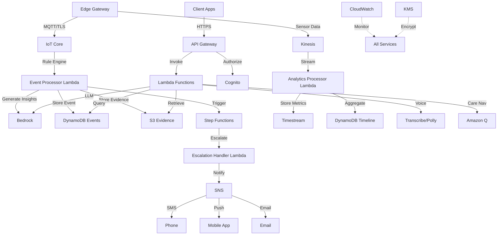

**Cross-Service Communication**:
- All inter-service communication uses IAM roles (no API keys)
- VPC endpoints for private communication (no internet gateway)
- Service-to-service authentication via SigV4 signing
- Distributed tracing with X-Ray for end-to-end visibility
- Centralized logging to CloudWatch Logs with structured JSON
- EventBridge for event-driven architecture and service decoupling


## Model Routing Logic

### Purpose

Intelligently route AI/ML inference requests between edge devices and cloud services based on task requirements, connectivity, latency constraints, and cost optimization.

### Model Router Architecture

**Router Decision Engine**:
```python
class ModelRouter:
    def route_inference(self, task_type, context):
        """
        Route inference request to optimal execution environment.
        
        Args:
            task_type: Type of inference (fall_detection, llm_reasoning, voice_asr, etc.)
            context: Current system state (connectivity, latency, confidence, etc.)
        
        Returns:
            Execution plan with target environment and fallback options
        """
        # Check connectivity
        cloud_available = context.internet_connected and context.latency_ms < 200
        
        # Route based on task type and constraints
        if task_type == "fall_detection":
            return self._route_fall_detection(context, cloud_available)
        elif task_type == "llm_reasoning":
            return self._route_llm(context, cloud_available)
        elif task_type == "voice_asr":
            return self._route_voice(context, cloud_available)
        elif task_type == "pose_estimation":
            return self._route_pose(context, cloud_available)
        elif task_type == "acoustic_event_detection":
            return self._route_aed(context, cloud_available)
```

### Routing Decision Matrix

| Task Type | Primary Target | Fallback | Latency Requirement | Rationale |
|-----------|---------------|----------|---------------------|-----------|
| **Fall Detection** | Edge (Triton/CPU) | N/A (always edge) | <500ms | Safety-critical, must work offline |
| **Pose Estimation** | Edge (Jetson GPU) | Edge (CPU) | <100ms (30 FPS) | Real-time requirement, privacy (no video upload) |
| **Acoustic Event Detection** | Edge (CPU) | N/A (always edge) | <1s | Privacy (no raw audio upload), offline capability |
| **Wake Word Detection** | Edge (MCU) | N/A (always edge) | <100ms | Ultra-low latency, always-on |
| **Voice ASR** | AWS Transcribe | NVIDIA Riva (edge) | <2s | Cloud for accuracy, edge for offline |
| **Voice TTS** | Amazon Polly | NVIDIA Riva (edge) | <1s | Cloud for natural voices, edge for offline |
| **LLM Reasoning (Complex)** | AWS Bedrock (Nemotron) | Gemma (edge) | <5s | Cloud for complex reasoning, edge for basic |
| **LLM Reasoning (Simple)** | Gemma (edge) | AWS Bedrock | <2s | Edge for low latency, cloud for fallback |
| **Medical Triage** | AWS Bedrock (MedGemma) | Gemma (edge) + cached responses | <5s | Cloud for medical accuracy, edge for offline |
| **Care Navigation** | Amazon Q + Bedrock KB | Cached Knowledge Pack (edge) | <3s | Cloud for RAG, edge for offline |
| **Routine Modeling** | Edge (GMM) | AWS SageMaker (retraining) | <1s | Edge for inference, cloud for training |
| **Documentation Generation** | AWS Bedrock (Nemotron) | Template-based (edge) | <30s | Cloud for quality, edge for basic |

### Routing Logic Implementation

**1. Fall Detection Routing**:
```python
def _route_fall_detection(self, context, cloud_available):
    # Always execute on edge for safety and privacy
    if context.has_gpu:
        return ExecutionPlan(
            primary=EdgeInference(model="fall_detection_gpu", device="cuda"),
            fallback=None  # No fallback - must work
        )
    else:
        return ExecutionPlan(
            primary=EdgeInference(model="fall_detection_cpu", device="cpu"),
            fallback=None
        )
```

**2. LLM Reasoning Routing**:
```python
def _route_llm(self, context, cloud_available):
    # Route based on complexity and connectivity
    if context.query_complexity == "simple" and context.has_local_gemma:
        return ExecutionPlan(
            primary=EdgeInference(model="gemma-2b", device="cpu"),
            fallback=CloudInference(service="bedrock", model="nemotron") if cloud_available else None
        )
    elif cloud_available:
        return ExecutionPlan(
            primary=CloudInference(service="bedrock", model="nemotron"),
            fallback=EdgeInference(model="gemma-2b", device="cpu") if context.has_local_gemma else CachedResponse()
        )
    else:
        # Offline mode
        return ExecutionPlan(
            primary=EdgeInference(model="gemma-2b", device="cpu") if context.has_local_gemma else CachedResponse(),
            fallback=None
        )
```

**3. Voice Processing Routing**:
```python
def _route_voice(self, context, cloud_available):
    # Prefer cloud for accuracy, fallback to edge for offline
    if cloud_available and context.latency_ms < 150:
        return ExecutionPlan(
            primary=CloudInference(service="transcribe", language=context.language),
            fallback=EdgeInference(model="riva_asr", device="cpu") if context.has_riva else None
        )
    elif context.has_riva:
        return ExecutionPlan(
            primary=EdgeInference(model="riva_asr", device="cpu"),
            fallback=CloudInference(service="transcribe") if cloud_available else None
        )
    else:
        # No local ASR, must use cloud
        return ExecutionPlan(
            primary=CloudInference(service="transcribe"),
            fallback=ErrorResponse("Voice recognition unavailable offline")
        )
```

**4. Pose Estimation Routing**:
```python
def _route_pose(self, context, cloud_available):
    # Always edge for privacy (no video upload)
    if context.has_gpu:
        return ExecutionPlan(
            primary=EdgeInference(model="pose_deepstream", device="cuda", fps=30),
            fallback=EdgeInference(model="pose_cpu", device="cpu", fps=10)
        )
    else:
        return ExecutionPlan(
            primary=EdgeInference(model="pose_cpu", device="cpu", fps=10),
            fallback=None  # Degraded performance but still functional
        )
```

### Dynamic Routing Factors

**Connectivity-Based Routing**:
- **Online (latency < 200ms)**: Prefer cloud for complex tasks, edge for real-time
- **Degraded (latency 200-500ms)**: Prefer edge, use cloud only for non-time-sensitive tasks
- **Offline**: All processing on edge, use cached responses where possible

**Confidence-Based Routing**:
- **High confidence (>0.90)**: Use faster edge models
- **Medium confidence (0.70-0.90)**: Use cloud for verification
- **Low confidence (<0.70)**: Always use cloud for accuracy

**Cost-Based Routing**:
- **B2C deployments**: Prefer edge to minimize cloud costs
- **B2B deployments**: Use cloud for better accuracy and features
- **High-volume periods**: Batch requests to reduce API calls

**Privacy-Based Routing**:
- **Raw audio/video**: Never leave edge (feature extraction only)
- **PHI data**: Encrypt before cloud transmission
- **Consent-dependent**: Route based on user privacy settings

### Model Deployment Strategy

**Edge Model Deployment**:
1. Train models on AWS SageMaker using public datasets
2. Optimize models with TensorRT (NVIDIA) or ONNX Runtime (CPU)
3. Package models in Docker containers
4. Deploy via AWS IoT Core OTA updates
5. Validate deployment with test inference
6. Monitor performance metrics (latency, accuracy, resource usage)

**Cloud Model Deployment**:
1. Use AWS Bedrock for managed LLM services (no deployment needed)
2. Deploy custom models to SageMaker endpoints
3. Configure auto-scaling based on request volume
4. Implement A/B testing for model updates
5. Monitor via CloudWatch metrics

### Model Version Management

**Versioning Strategy**:
- Semantic versioning: `major.minor.patch` (e.g., `1.2.3`)
- Major: Breaking changes to model interface
- Minor: New features or improved accuracy
- Patch: Bug fixes or performance improvements

**Rollout Strategy**:
- Canary deployment: 5% of devices for 24 hours
- Gradual rollout: 25% → 50% → 100% over 7 days
- Automatic rollback on error rate > 5%
- A/B testing for accuracy comparison

**Model Registry**:
- Store all model versions in S3 with metadata
- Track performance metrics per version
- Maintain compatibility matrix (model version ↔ edge gateway version)
- Implement blue-green deployment for zero-downtime updates


## Privacy Boundary Explanation

### Privacy Architecture Overview

The AETHER system implements a **defense-in-depth privacy architecture** with multiple layers of protection to ensure that sensitive personal data never leaves the home without explicit consent.

### Privacy Boundary Layers

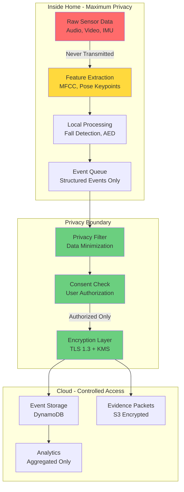

### Layer 1: Sensor-Level Privacy (Inside Home)

**Audio Privacy**:
- **Raw Audio**: Captured by Acoustic Sentinel MCU, never stored or transmitted
- **Feature Extraction**: MFCC, spectral centroid, zero-crossing rate computed on-device
- **Transmission**: Only 128-dimensional feature vectors transmitted (not reconstructible to speech)
- **Storage**: Features stored locally for 24 hours, then deleted

**Video Privacy**:
- **Raw Video**: Captured by camera, processed frame-by-frame on Edge Gateway
- **Pose Extraction**: 17-point skeleton keypoints extracted (x, y, confidence per keypoint)
- **Frame Disposal**: Video frames discarded immediately after pose extraction
- **Transmission**: Only pose keypoints transmitted (no facial features, no identifiable information)
- **Storage**: Pose keypoints stored locally for 24 hours, then deleted

**Wearable Privacy**:
- **Raw IMU**: 100 Hz accelerometer/gyroscope readings captured on wearable
- **Feature Extraction**: Acceleration patterns, orientation changes, activity levels computed on-device
- **Transmission**: Only high-level features transmitted (not raw sensor samples)
- **Storage**: Features stored locally for 24 hours, then deleted

### Layer 2: Edge Gateway Privacy Filter

**Data Minimization Engine**:
```python
class PrivacyFilter:
    def filter_event(self, raw_event, privacy_settings):
        """
        Apply privacy filtering before cloud transmission.
        
        Privacy Levels:
        - MINIMAL: Events only (no sensor data)
        - STANDARD: Events + aggregated features
        - ENHANCED: Events + detailed features (with consent)
        """
        filtered_event = {
            "event_id": raw_event.event_id,
            "event_type": raw_event.event_type,
            "timestamp": raw_event.timestamp,
            "severity": raw_event.severity,
            "confidence": raw_event.confidence
        }
        
        if privacy_settings.level == "MINIMAL":
            # Only event metadata, no sensor data
            return filtered_event
        
        elif privacy_settings.level == "STANDARD":
            # Add aggregated features (no raw data)
            filtered_event["aggregated_features"] = {
                "activity_level": raw_event.compute_activity_level(),
                "ambient_sound_level": raw_event.compute_ambient_level(),
                "movement_detected": raw_event.has_movement()
            }
            return filtered_event
        
        elif privacy_settings.level == "ENHANCED":
            # Add detailed features (requires consent)
            if privacy_settings.acoustic_consent:
                filtered_event["audio_features"] = raw_event.audio_features
            if privacy_settings.pose_consent:
                filtered_event["pose_keypoints"] = raw_event.pose_keypoints
            if privacy_settings.imu_consent:
                filtered_event["imu_features"] = raw_event.imu_features
            return filtered_event
```

**Consent Enforcement**:
- Check consent ledger before transmitting any data
- Block transmission if consent is revoked
- Log all consent checks for audit trail
- Provide real-time consent status in UI

### Layer 3: Encryption and Secure Transmission

**Transport Security**:
- **TLS 1.3**: All data in transit encrypted with TLS 1.3
- **Certificate Pinning**: Edge Gateway validates AWS IoT Core certificate
- **Mutual TLS**: Both client and server authenticate each other
- **Perfect Forward Secrecy**: Session keys rotated every 24 hours

**Data Encryption**:
- **At Rest**: AES-256 encryption for all data in DynamoDB and S3
- **In Transit**: TLS 1.3 with strong cipher suites only
- **Key Management**: AWS KMS with automatic key rotation (90 days)
- **Field-Level Encryption**: PHI fields encrypted separately with different keys

### Layer 4: Cloud Access Control

**IAM Policies**:
- Principle of least privilege for all roles
- Separate roles for caregivers, nurses, clinic managers
- Time-bound access tokens (1 hour expiration)
- MFA required for sensitive operations

**Data Isolation**:
- Multi-tenant architecture with strict data isolation
- Separate DynamoDB partitions per home
- S3 bucket policies restricting cross-home access
- VPC isolation for compute resources

**Audit Logging**:
- CloudTrail logs all API calls
- DynamoDB Streams capture all data changes
- S3 access logs for all object retrievals
- Immutable audit trail with cryptographic hashing

### Privacy Guarantees

**What Never Leaves the Home**:
1. Raw audio recordings (unless explicitly consented for specific use case)
2. Raw video frames (only pose keypoints transmitted)
3. Raw IMU sensor samples (only features transmitted)
4. Conversations and voice interactions (only transcribed text transmitted)
5. Facial images or biometric identifiers

**What Leaves the Home (With Consent)**:
1. Structured events (fall detected, medication taken, etc.)
2. Audio features (MFCC, spectral features - not reconstructible to speech)
3. Pose keypoints (skeleton only, no facial features)
4. IMU features (acceleration patterns, not raw samples)
5. Aggregated metrics (activity level, sleep duration, etc.)

**What Requires Explicit Opt-In**:
1. Raw audio recording for specific debugging purposes
2. Detailed sensor data for research participation
3. Sharing data with third-party researchers
4. Cross-home analytics for population health studies

### Privacy Compliance

**GDPR Compliance**:
- Right to access: Export all data in JSON/CSV format
- Right to erasure: Delete all data within 30 days
- Right to portability: Standard data formats (FHIR, JSON)
- Right to rectification: Update incorrect data
- Data minimization: Only collect necessary data
- Purpose limitation: Use data only for stated purposes

**HIPAA Compliance**:
- PHI encryption at rest and in transit
- Access controls and audit logging
- Business Associate Agreements (BAAs) with AWS
- Breach notification procedures
- Minimum necessary standard for data access

**Indian Data Protection**:
- Data localization: Store data in Indian AWS regions (Mumbai, Hyderabad)
- Consent management: Explicit, informed, and revocable consent
- Data fiduciary obligations: Responsible data handling
- Cross-border transfer restrictions: Comply with data residency requirements


## Offline-First Behavior

### Design Philosophy

The AETHER system is designed with **offline-first architecture** where all safety-critical functions operate without internet connectivity. Cloud services enhance the experience but are not required for core safety monitoring.

### Offline Capabilities Matrix

| Feature | Offline Capable | Degradation | Cloud Enhancement |
|---------|----------------|-------------|-------------------|
| **Fall Detection** | ✅ Full | None | Cloud-based triage card generation |
| **Voice Wake Word** | ✅ Full | None | N/A |
| **Voice Commands** | ✅ Full | None | N/A |
| **Acoustic Event Detection** | ✅ Full | None | Cloud-based pattern analysis |
| **Medication Reminders** | ✅ Full | None | Cloud-based adherence analytics |
| **Daily Check-Ins** | ✅ Full | None | Cloud-based trend analysis |
| **Emergency Escalation** | ✅ Partial | SMS/Call only (no push) | Push notifications, incident packets |
| **Care Navigation** | ✅ Partial | Cached responses only | Real-time RAG with latest knowledge |
| **Voice ASR/TTS** | ⚠️ Conditional | Requires NVIDIA Riva | AWS Transcribe/Polly for better accuracy |
| **LLM Reasoning** | ⚠️ Conditional | Basic Gemma only | AWS Bedrock for complex reasoning |
| **Timeline Sync** | ❌ No | Events queued locally | Real-time timeline updates |
| **Mobile App Updates** | ❌ No | Last cached state | Real-time event notifications |

### Offline Architecture

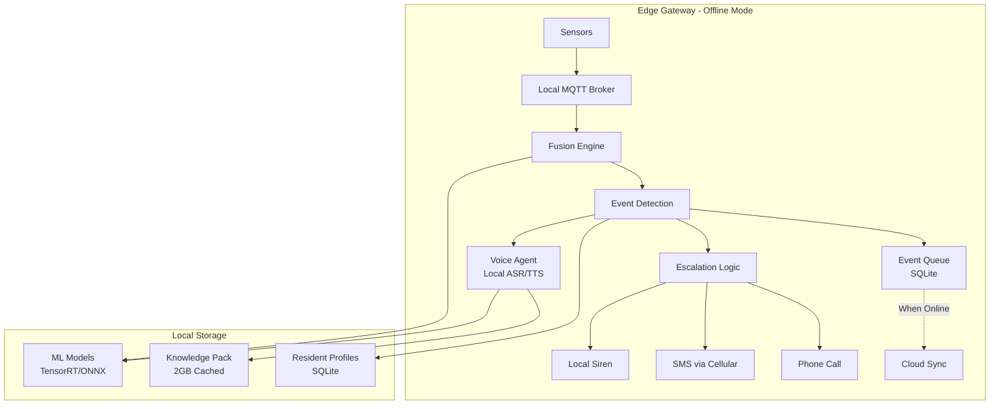

### Offline Event Queue

**Local Event Storage**:
```python
class OfflineEventQueue:
    def __init__(self, db_path="/var/aether/events.db"):
        self.db = sqlite3.connect(db_path)
        self.create_tables()
    
    def create_tables(self):
        self.db.execute("""
            CREATE TABLE IF NOT EXISTS events (
                event_id TEXT PRIMARY KEY,
                timestamp INTEGER,
                event_type TEXT,
                severity TEXT,
                data BLOB,
                synced INTEGER DEFAULT 0,
                created_at INTEGER
            )
        """)
        self.db.execute("""
            CREATE INDEX IF NOT EXISTS idx_synced 
            ON events(synced, timestamp)
        """)
    
    def enqueue(self, event):
        """Store event locally for later sync."""
        self.db.execute("""
            INSERT INTO events (event_id, timestamp, event_type, severity, data, created_at)
            VALUES (?, ?, ?, ?, ?, ?)
        """, (
            event.event_id,
            event.timestamp,
            event.event_type,
            event.severity,
            json.dumps(event.data),
            int(time.time())
        ))
        self.db.commit()
    
    def get_unsynced(self, limit=100):
        """Retrieve unsynced events for cloud transmission."""
        cursor = self.db.execute("""
            SELECT event_id, timestamp, event_type, severity, data
            FROM events
            WHERE synced = 0
            ORDER BY timestamp ASC
            LIMIT ?
        """, (limit,))
        return [self._deserialize_event(row) for row in cursor.fetchall()]
    
    def mark_synced(self, event_ids):
        """Mark events as successfully synced."""
        placeholders = ','.join('?' * len(event_ids))
        self.db.execute(f"""
            UPDATE events
            SET synced = 1
            WHERE event_id IN ({placeholders})
        """, event_ids)
        self.db.commit()
    
    def cleanup_old_events(self, days=7):
        """Delete synced events older than specified days."""
        cutoff = int(time.time()) - (days * 86400)
        self.db.execute("""
            DELETE FROM events
            WHERE synced = 1 AND created_at < ?
        """, (cutoff,))
        self.db.commit()
```

**Queue Management**:
- Maximum queue size: 10,000 events (approximately 7 days at high volume)
- Automatic cleanup: Delete synced events older than 7 days
- Priority queuing: Critical events (falls, distress) synced first
- Conflict resolution: Server timestamp wins for overlapping events

### Offline Escalation

**Escalation Modes**:

**Online Mode**:
1. Local siren (immediate)
2. Push notification to mobile app (5 seconds)
3. SMS to caregiver (10 seconds)
4. Phone call to caregiver (30 seconds if no acknowledgment)
5. Escalate to nurse (5 minutes if no acknowledgment)
6. Emergency services (10 minutes if no acknowledgment)

**Offline Mode**:
1. Local siren (immediate)
2. SMS to caregiver via cellular modem (10 seconds)
3. Phone call to caregiver via cellular modem (30 seconds if no acknowledgment)
4. Phone call to nurse (5 minutes if no acknowledgment)
5. Phone call to emergency services (10 minutes if no acknowledgment)

**Cellular Backup**:
- Edge Gateway includes optional cellular modem (4G LTE)
- Automatic failover to cellular when WiFi/Ethernet unavailable
- SMS and voice calls work without internet
- Data transmission over cellular for critical events only (cost optimization)

### Offline Voice Processing

**Local ASR/TTS Options**:

**Option 1: NVIDIA Riva (Jetson Orin Nano)**:
- Full ASR and TTS on-device
- Supports English, Spanish, Hindi, Mandarin
- Latency: <500ms for ASR, <300ms for TTS
- Accuracy: 90-95% (slightly lower than cloud)

**Option 2: Cached Responses (Raspberry Pi 5)**:
- Pre-generated TTS audio for common phrases
- Template-based responses for check-ins
- Limited ASR using lightweight models (Vosk, Whisper.cpp)
- Accuracy: 80-85% for common commands

**Fallback Strategy**:
```python
def process_voice_offline(audio, language):
    # Try local ASR if available
    if has_nvidia_riva():
        transcript = riva_asr(audio, language)
        response = generate_response_local(transcript)
        audio_response = riva_tts(response, language)
        return audio_response
    
    # Fallback to cached responses
    elif has_cached_responses():
        # Use simple keyword matching
        keywords = extract_keywords(audio)
        if keywords in CACHED_RESPONSES:
            return CACHED_RESPONSES[keywords]
        else:
            return CACHED_RESPONSES["default"]
    
    # Last resort: beep confirmation only
    else:
        return play_beep_confirmation()
```

### Offline Care Navigation

**Cached Knowledge Pack**:
- 2GB compressed knowledge base stored on Edge Gateway
- Updated quarterly via OTA when online
- Covers common health topics: medication, nutrition, fall prevention, chronic disease management
- Indexed for fast keyword search

**Offline Query Processing**:
```python
def care_navigation_offline(query, knowledge_pack):
    # Extract keywords from query
    keywords = extract_keywords(query)
    
    # Search cached knowledge pack
    results = knowledge_pack.search(keywords, limit=3)
    
    if results:
        # Generate response from cached content
        response = template_response(results[0])
        response += "\n\n[Offline Mode: Using cached knowledge. Connect to internet for latest information.]"
        return response
    else:
        return "I don't have information on that in offline mode. Please connect to the internet or contact your healthcare provider."
```

### Online/Offline Transition

**Connectivity Monitoring**:
```python
class ConnectivityMonitor:
    def __init__(self):
        self.online = False
        self.last_check = 0
        self.check_interval = 30  # seconds
    
    def check_connectivity(self):
        """Check internet connectivity by pinging AWS IoT Core."""
        try:
            response = requests.get("https://iot.amazonaws.com/ping", timeout=5)
            self.online = response.status_code == 200
        except:
            self.online = False
        
        self.last_check = time.time()
        return self.online
    
    def on_online(self):
        """Callback when connectivity is restored."""
        logger.info("Internet connectivity restored")
        
        # Sync queued events
        sync_manager.sync_events()
        
        # Update models if needed
        model_manager.check_for_updates()
        
        # Update knowledge pack if needed
        knowledge_pack.check_for_updates()
        
        # Notify user
        voice_agent.announce("Internet connection restored")
    
    def on_offline(self):
        """Callback when connectivity is lost."""
        logger.warning("Internet connectivity lost - entering offline mode")
        
        # Switch to offline models
        model_router.enable_offline_mode()
        
        # Notify user
        voice_agent.announce("Operating in offline mode. Core safety features remain active.")
```

**Sync Strategy**:
- Incremental sync: Only transmit events since last successful sync
- Batch sync: Group events into batches of 100 for efficiency
- Priority sync: Critical events (falls, distress) synced first
- Retry logic: Exponential backoff for failed syncs (1s, 2s, 4s, 8s, 16s)
- Conflict resolution: Server timestamp wins, client updates local state

### Offline Performance Targets

| Metric | Target | Measurement |
|--------|--------|-------------|
| Fall detection latency | <500ms | Edge inference time |
| Voice command latency | <2s | Wake word to action |
| Event queue capacity | 10,000 events | SQLite storage |
| Offline duration | 7 days | Before queue full |
| Sync time (1000 events) | <60s | When connectivity restored |
| Local storage | <10GB | Models + queue + logs |
| Battery backup | 24 hours | UPS for Edge Gateway |


## Components and Interfaces

### Core Components

#### 1. Edge Gateway

**Purpose**: Local processing hub for sensor fusion, privacy filtering, and offline operations.

**Interfaces**:
- Input: MQTT messages from SenseMesh (sensors)
- Output: MQTT to AWS IoT Core (events), HTTP to Bedrock (LLM queries)
- Local: Triton Server (model inference), MQTT Broker (sensor coordination)

**Key Operations**:
- `fuse_fall_signals(imu_data, pose_keypoints, acoustic_features) -> FallEvent`
- `extract_audio_features(raw_audio) -> SpectralFeatures`
- `detect_acoustic_event(features) -> AcousticEvent`
- `process_voice_command(audio) -> Command`
- `queue_event_offline(event) -> bool`

#### 2. Acoustic Sentinel

**Purpose**: Low-power acoustic monitoring node with on-device feature extraction.

**Hardware**: ESP32 MCU with I2S microphone

**Interfaces**:
- Input: Continuous audio stream from microphone
- Output: MQTT messages with audio features to Edge Gateway

**Key Operations**:
- `extract_mfcc(audio_buffer) -> MFCCFeatures`
- `detect_wake_word(audio_buffer) -> bool`
- `compute_ambient_level(audio_buffer) -> float`

#### 3. Wearable IMU

**Purpose**: Pendant or wristband with accelerometer/gyroscope for fall detection.

**Hardware**: nRF52 BLE SoC with 6-axis IMU

**Interfaces**:
- Input: IMU sensor readings (100 Hz sampling)
- Output: BLE to Edge Gateway (acceleration events)

**Key Operations**:
- `detect_impact(accel_data) -> ImpactEvent`
- `detect_orientation_change(gyro_data) -> OrientationEvent`
- `compute_activity_level(accel_data) -> ActivityLevel`

#### 4. Voice Agent

**Purpose**: Voice-first interaction system with wake-word detection and multi-language support.

**Interfaces**:
- Input: Audio from Acoustic Sentinel, text from LLM
- Output: TTS audio, commands to system components

**Key Operations**:
- `process_wake_word() -> bool`
- `transcribe_speech(audio) -> string`
- `generate_response(query, context) -> string`
- `synthesize_speech(text, language) -> audio`

#### 5. Fall Detection Fusion Engine

**Purpose**: Multi-sensor fusion for high-confidence fall detection.

**Interfaces**:
- Input: IMU events, pose keypoints, acoustic features
- Output: FallEvent with confidence score

**Algorithm**:
```python
def fuse_fall_signals(imu_event, pose_event, acoustic_event):
    confidence = 0.0
    
    # Wearable IMU signal (weight: 0.4)
    if imu_event.impact_force > 3.0:  # >3g acceleration
        confidence += 0.4 * imu_event.confidence
    
    # Pose estimation signal (weight: 0.4)
    if pose_event.fall_pattern_detected:
        confidence += 0.4 * pose_event.confidence
    
    # Acoustic signal (weight: 0.2)
    if acoustic_event.impact_detected:
        confidence += 0.2 * acoustic_event.confidence
    
    return FallEvent(confidence=confidence, timestamp=now())
```

**Confidence Thresholds**:
- confidence >= 0.90: Immediate escalation
- 0.70 <= confidence < 0.90: Voice check-in "Are you okay?"
- 0.50 <= confidence < 0.70: Log event, no immediate action
- confidence < 0.50: Discard as noise


#### 6. Acoustic Event Detection (AED) Engine

**Purpose**: Detect safety-critical acoustic events (screams, glass break, impacts, coughing).

**Model Architecture**: CNN-based classifier trained on spectral features

**Interfaces**:
- Input: Audio features from Acoustic Sentinel
- Output: AcousticEvent with event_type and confidence

**Event Types**:
- Scream (confidence threshold: 0.85)
- Glass break (threshold: 0.80)
- Impact sound (threshold: 0.75)
- Coughing (threshold: 0.75)
- Doorbell/phone ring (threshold: 0.80)
- Prolonged silence (threshold: ambient < 30dB for 4+ hours)

**Training Data**: Synthetic audio from Omniverse + public datasets (no real patient audio)

#### 7. Medication Management System

**Purpose**: Track medication adherence with voice confirmations and NFC identification.

**Components**:
- MedDock: Physical dock with NFC reader and pressure sensors
- Medication Scheduler: Manages reminder times and escalation
- Voice Confirmation Handler: Processes "taken"/"not taken" responses

**Interfaces**:
- Input: NFC tag reads, pressure sensor events, voice confirmations
- Output: Medication adherence events, reminders via Voice Agent

**Key Operations**:
- `schedule_medication(med_name, time, critical) -> Schedule`
- `detect_removal(nfc_id, pressure_change) -> RemovalEvent`
- `process_voice_confirmation(response) -> AdherenceEvent`
- `escalate_missed_dose(medication, timeout) -> EscalationEvent`

#### 8. LLM Safety Layer

**Purpose**: Constrain LLM responses to prevent hallucinations and unsafe medical advice.

**Implementation**: AWS Bedrock Guardrails + RAG with vetted Knowledge Packs

**Safety Mechanisms**:
1. **Retrieval-Limited Responses**: Only generate answers from Knowledge Pack content
2. **Content Filters**: Block invented medication names, dosages, diagnoses
3. **Confidence Gating**: Require high confidence or respond "I don't have information on that"
4. **Red Team Harness**: 500+ adversarial prompts tested before deployment
5. **Audit Trail**: All queries and responses logged in CloudWatch

**Guardrail Configuration**:
```json
{
  "topicFilters": ["medical_diagnosis", "medication_dosing", "treatment_decisions"],
  "contentFilters": {
    "medications": "formulary_only",
    "dosages": "guideline_only"
  },
  "piiRedaction": ["names", "addresses", "phone_numbers"],
  "toxicityThreshold": 0.1
}
```


#### 9. Escalation Ladder

**Purpose**: Multi-tier alert system with configurable timeouts and response tracking.

**Tiers**:
1. **Local Siren**: Immediate audio alert at Edge Gateway (0 seconds)
2. **Caregiver**: SMS + push notification (5 minute SLA)
3. **Nurse**: SMS + push + phone call (10 minute SLA)
4. **Emergency Services**: Automated call with incident packet (immediate for critical events)

**Escalation Logic**:
```python
def escalate_event(event):
    if event.confidence >= 0.90 or event.type == "fall_with_immobility":
        # Critical: Skip to emergency services
        notify_emergency_services(event)
    elif event.confidence >= 0.70:
        # High: Start with caregiver
        notify_caregiver(event, timeout=5*60)
        if not acknowledged_within_timeout():
            notify_nurse(event, timeout=10*60)
            if not acknowledged_within_timeout():
                notify_emergency_services(event)
    else:
        # Medium: Log only
        log_event(event)
```

**Voice Override**: "I need help" command bypasses confidence gating and escalates immediately.

#### 10. Care Navigation Assistant

**Purpose**: Voice-delivered guidance using Amazon Q with RAG over vetted medical knowledge.

**Architecture**:
- Amazon Q: Conversational AI interface
- Bedrock Knowledge Bases: Vetted medical content (NHS guidelines, CDC, WHO)
- Guardrails: Prevent out-of-scope responses

**Response Pattern**:
```
User: "What should I do about chest pain?"

System: "Based on NHS guidelines for chest pain, you should seek urgent care now. 
Chest pain can be serious and requires immediate medical evaluation. 
Call 999 or go to A&E immediately.

This is advisory guidance only, not a medical diagnosis. 
When in doubt, always contact emergency services."

[Evidence: NHS Chest Pain Guidelines, Section 2.1]
```

**Offline Mode**: Cached Knowledge Pack (2GB compressed) on Edge Gateway for degraded connectivity.

#### 11. Documentation Assistant

**Purpose**: Generate SOAP-like clinical notes from Timeline events and check-in data.

**SOAP Structure**:
- **Subjective**: Daily check-in responses, voice interactions
- **Objective**: Sensor data (activity levels, sleep patterns, medication adherence)
- **Assessment**: AI-generated insights from Nemotron (trend analysis, concerns)
- **Plan**: Recommended interventions, follow-up actions

**Generation Process**:
1. Query DynamoDB for last 7 days of events
2. Extract structured data (check-ins, medication, falls, activities)
3. Use Nemotron to synthesize natural language summary
4. Present draft to Nurse for review and sign-off
5. Store approved documentation in S3 with FHIR export


#### 12. Routine Modeling Engine

**Purpose**: Learn normal daily patterns and detect subtle behavioral drift indicating decline.

**Baseline Establishment**: 14-day observation period to learn typical patterns

**Tracked Patterns**:
- Wake time (mean ± 2 std dev)
- Meal times and kitchen activity frequency
- Bathroom visit frequency
- Activity periods (active vs. sedentary)
- Sleep time and duration

**Anomaly Detection**:
- Statistical: Z-score > 2.5 for 3 consecutive days
- Temporal: Routine drift > 2 hours from baseline
- Frequency: Activity count change > 40% over 2 weeks

**Model**: Gaussian Mixture Model (GMM) trained on AWS SageMaker, deployed to Edge Gateway

**Output**: Routine drift events with visualizations showing pattern changes

#### 13. Multi-Profile Manager

**Purpose**: Support multiple residents in same household with separate monitoring.

**Profile Isolation**:
- Separate Baselines, Timelines, medication schedules
- Individual privacy settings and consent
- Per-resident voice recognition (optional)
- Separate caregiver access permissions

**Voice Recognition**:
- AWS Transcribe speaker diarization
- Train on each resident's voice during setup
- Confidence threshold: 0.80 for speaker identification
- Fallback: "Who is speaking?" prompt if confidence < 0.80

**Sensor Association**:
- Wearable: Device ID maps to resident
- Acoustic: Voice recognition or manual confirmation
- Pose: Facial recognition disabled (privacy), manual association
- Medication: NFC tag + voice confirmation

#### 14. Digital Twin Simulator

**Purpose**: Generate synthetic sensor data for testing and training without real patient data.

**Implementation**: NVIDIA Omniverse for 3D home simulation

**Capabilities**:
- Photorealistic 3D home environments with configurable layouts
- Physics-based fall simulation with realistic motion
- Synthetic sensor data generation (video, audio, IMU, environmental)
- Scenario library: normal aging, gradual decline, acute events
- Time compression: 90 days of data in 15 minutes

**Use Cases**:
- Model training (fall detection, pose estimation, AED)
- System testing (end-to-end workflows)
- Demo generation (marketing, stakeholder presentations)
- Edge case exploration (rare events, sensor failures)

**Data Labeling**: All synthetic data tagged with ground truth labels for supervised learning


## Data Models

### Event Schema

All events follow a common schema stored in DynamoDB:

```typescript
interface Event {
  event_id: string;           // UUID
  home_id: string;            // Partition key
  timestamp: number;          // Sort key (Unix epoch ms)
  event_type: EventType;      // fall | medication | acoustic | routine_drift | ...
  severity: Severity;         // critical | high | medium | low
  confidence: number;         // 0.0 - 1.0
  resident_id?: string;       // For multi-profile households
  
  // Event-specific data
  data: {
    [key: string]: any;
  };
  
  // Sensor sources
  sources: {
    sensor_id: string;
    sensor_type: string;
    confidence: number;
  }[];
  
  // Escalation tracking
  escalation?: {
    tier: number;
    notified: string[];       // User IDs
    acknowledged_by?: string;
    acknowledged_at?: number;
    resolved_at?: number;
  };
  
  // Evidence packet reference
  evidence_packet_url?: string;  // S3 URL
  
  // Metadata
  created_at: number;
  updated_at: number;
  ttl?: number;               // DynamoDB TTL for auto-deletion
}

enum EventType {
  FALL = "fall",
  FALL_WITH_IMMOBILITY = "fall_with_immobility",
  ACOUSTIC_DISTRESS = "acoustic_distress",
  GLASS_BREAK = "glass_break",
  PROLONGED_SILENCE = "prolonged_silence",
  IMPACT_SOUND = "impact_sound",
  MEDICATION_TAKEN = "medication_taken",
  MEDICATION_MISSED = "medication_missed",
  MEDICATION_CONFUSION = "medication_confusion",
  ROUTINE_DRIFT = "routine_drift",
  DECLINING_HEALTH = "declining_health",
  RESPIRATORY_CONCERN = "respiratory_concern",
  MISSED_DOORBELL = "missed_doorbell",
  SYSTEM_HEALTH = "system_health"
}

enum Severity {
  CRITICAL = "critical",    // Immediate emergency response
  HIGH = "high",            // Escalate to caregiver/nurse
  MEDIUM = "medium",        // Log and monitor
  LOW = "low"               // Informational only
}
```

### Fall Event Data Model

```typescript
interface FallEventData {
  // Fusion inputs
  imu_impact_force?: number;      // g-force
  imu_confidence?: number;
  pose_fall_detected?: boolean;
  pose_confidence?: number;
  acoustic_impact?: boolean;
  acoustic_confidence?: number;
  
  // Fused result
  fused_confidence: number;
  
  // Post-fall tracking
  immobility_duration?: number;   // seconds
  voice_check_in_response?: string;  // "okay" | "help" | "no_response"
  
  // Location
  room?: string;
  coordinates?: {x: number, y: number};
}
```

### Medication Event Data Model

```typescript
interface MedicationEventData {
  medication_id: string;
  medication_name: string;
  custom_name?: string;           // "blue pill"
  scheduled_time: number;
  actual_time?: number;
  
  // Adherence tracking
  status: "taken" | "missed" | "late" | "confused";
  confirmation_method: "voice" | "sensor" | "manual";
  
  // NFC tracking
  nfc_tag_id?: string;
  removal_detected: boolean;
  
  // Escalation
  critical: boolean;
  escalation_timeout: number;     // seconds
  escalated: boolean;
}
```


### Acoustic Event Data Model

```typescript
interface AcousticEventData {
  acoustic_type: "scream" | "glass_break" | "impact" | "cough" | "doorbell" | "phone_ring" | "silence";
  confidence: number;
  
  // Audio features (NOT raw audio)
  features: {
    mfcc: number[];              // Mel-frequency cepstral coefficients
    spectral_centroid: number;
    spectral_rolloff: number;
    zero_crossing_rate: number;
    rms_energy: number;
  };
  
  // Sentinel info
  sentinel_id: string;
  room: string;
  
  // Correlation
  correlated_with?: string[];    // Other event IDs
}
```

### Timeline Schema

Timeline is a materialized view of events for efficient querying:

```typescript
interface TimelineEntry {
  home_id: string;               // Partition key
  date: string;                  // Sort key (YYYY-MM-DD)
  
  // Daily summary
  events: Event[];
  
  // Aggregated metrics
  metrics: {
    total_events: number;
    falls: number;
    medication_adherence_rate: number;
    activity_level: number;
    sleep_duration: number;
    check_in_mood_score: number;
  };
  
  // AI-generated summary
  summary: string;               // Generated by Nemotron
  concerns: string[];
  
  created_at: number;
  updated_at: number;
}
```

### Resident Profile Schema

```typescript
interface ResidentProfile {
  resident_id: string;           // Primary key
  home_id: string;               // GSI partition key
  
  // Personal info
  name: string;
  date_of_birth: string;
  language: "en" | "es" | "hi" | "kn" | "zh";
  
  // Medical info
  conditions: string[];
  medications: Medication[];
  allergies: string[];
  emergency_contacts: Contact[];
  
  // Baseline patterns
  baseline: {
    wake_time: {mean: number, std_dev: number};
    sleep_time: {mean: number, std_dev: number};
    meal_times: {mean: number, std_dev: number}[];
    activity_level: {mean: number, std_dev: number};
    established_at: number;
    observation_days: number;
  };
  
  // Privacy settings
  privacy: {
    acoustic_monitoring: boolean;
    camera_enabled: boolean;
    raw_audio_recording: boolean;
    data_retention_days: number;
    sensor_toggles: {[sensor_type: string]: boolean};
  };
  
  // Voice profile
  voice_profile?: {
    voice_id: string;
    trained_at: number;
    samples_count: number;
  };
  
  created_at: number;
  updated_at: number;
}

interface Medication {
  medication_id: string;
  name: string;
  custom_name?: string;
  dosage: string;
  schedule: {
    times: string[];             // ["08:00", "20:00"]
    days: string[];              // ["mon", "tue", ...]
  };
  critical: boolean;
  escalation_timeout: number;
  nfc_tag_id?: string;
}

interface Contact {
  contact_id: string;
  name: string;
  relationship: string;
  phone: string;
  email?: string;
  escalation_tier: number;       // 1=caregiver, 2=nurse, 3=emergency
  availability_schedule?: {
    [day: string]: {start: string, end: string}[];
  };
  notification_preferences: {
    sms: boolean;
    push: boolean;
    email: boolean;
    call: boolean;
  };
}
```


### Evidence Packet Schema

Evidence packets are stored in S3 as JSON files with supporting data:

```typescript
interface EvidencePacket {
  packet_id: string;
  event_id: string;
  home_id: string;
  resident_id: string;
  timestamp: number;
  
  // Event context
  event_summary: string;
  severity: Severity;
  
  // Sensor data (features only, not raw)
  sensor_data: {
    imu?: {
      acceleration: {x: number, y: number, z: number}[];
      gyroscope: {x: number, y: number, z: number}[];
      sampling_rate: number;
      duration: number;
    };
    
    acoustic?: {
      features: AcousticFeatures;
      ambient_level: number;
      event_type: string;
    };
    
    pose?: {
      keypoints: PoseKeypoint[][];  // Sequence of pose frames
      fall_pattern: boolean;
      confidence: number;
    };
  };
  
  // Recent context (24 hours)
  recent_events: Event[];
  recent_check_ins: CheckInResponse[];
  medication_adherence_24h: number;
  activity_summary_24h: string;
  
  // AI analysis
  ai_insights: {
    triage_card: string;
    recommended_actions: string[];
    risk_assessment: "low" | "medium" | "high" | "critical";
    confidence: number;
  };
  
  // Device health
  device_status: {
    battery_levels: {[device_id: string]: number};
    signal_quality: {[device_id: string]: number};
    last_seen: {[device_id: string]: number};
  };
  
  created_at: number;
  s3_url: string;
}

interface PoseKeypoint {
  x: number;
  y: number;
  confidence: number;
  keypoint_type: string;  // "nose" | "left_shoulder" | ...
}

interface CheckInResponse {
  timestamp: number;
  question: string;
  response: string;
  sentiment: number;      // -1.0 to 1.0
  extracted_data: {
    pain_score?: number;
    sleep_quality?: number;
    mood?: string;
    hydration?: boolean;
  };
}
```

### Knowledge Pack Schema

Knowledge Packs are vetted medical content for RAG:

```typescript
interface KnowledgePack {
  pack_id: string;
  version: string;
  published_at: number;
  
  // Content
  documents: KnowledgeDocument[];
  
  // Metadata
  topics: string[];
  languages: string[];
  source_organizations: string[];  // ["NHS", "CDC", "WHO"]
  
  // Validation
  reviewed_by: string[];           // Medical professional IDs
  review_date: number;
  next_review_date: number;
  
  // Deployment
  size_bytes: number;
  checksum: string;
}

interface KnowledgeDocument {
  document_id: string;
  title: string;
  content: string;
  source: string;
  url?: string;
  topic: string;
  language: string;
  
  // Embeddings for RAG
  embeddings: number[];
  
  // Metadata
  created_at: number;
  updated_at: number;
}
```


## Correctness Properties

A property is a characteristic or behavior that should hold true across all valid executions of a system—essentially, a formal statement about what the system should do. Properties serve as the bridge between human-readable specifications and machine-verifiable correctness guarantees.

### Property 1: Event Serialization Round-Trip

For any valid Event object, serializing then deserializing should produce an equivalent Event object.

**Validates: Requirements 86.5, 87.2**

### Property 2: Wake Word Detection Latency

For any wake word detection with confidence above 0.90, the Voice Agent should activate within 1 second.

**Validates: Requirements 1.2**

### Property 3: Privacy-Preserving Data Transmission

For any sensor data transmission from edge to cloud, only extracted features (not raw audio/video) should be transmitted by default.

**Validates: Requirements 2.7, 4.5, 81.2, 95.3**

### Property 4: Confidence-Based Escalation

For any event with confidence >= 0.90, the Escalation Ladder should activate immediately; for confidence 0.70-0.90, voice check-in should occur before escalation.

**Validates: Requirements 10.5, 43.2, 43.3**

### Property 5: Voice Command Cancellation

For any active alarm, speaking "cancel alert" should immediately halt the Escalation Ladder.

**Validates: Requirements 2.3**

### Property 6: Multi-Language Command Recognition

For any supported language (English, Spanish, Hindi, Kannada, Mandarin), voice commands should be recognized and responses generated in that language.

**Validates: Requirements 3.2**

### Property 7: Acoustic Event Detection Threshold

For any scream detection with confidence above 0.85, the Safety Loop should generate an acoustic distress Event.

**Validates: Requirements 4.2**

### Property 8: Glass Break with Immobility Escalation

For any glass break event where no motion is detected for 2 minutes, the Safety Loop should escalate to the Caregiver.

**Validates: Requirements 5.4**

### Property 9: Prolonged Silence Detection

For any period where ambient sound remains below 30 dB for more than 4 hours during daytime (8 AM - 8 PM), the system should generate a prolonged silence Event.

**Validates: Requirements 6.2**

### Property 10: Respiratory Concern Threshold

For any coughing pattern exceeding 20 events per hour for 2 consecutive hours, the system should generate a respiratory concern Event.

**Validates: Requirements 7.3**


### Property 11: Fall Detection Acceleration Threshold

For any wearable IMU acceleration pattern with impact force > 3g, the Edge Gateway should classify it as a potential fall.

**Validates: Requirements 10.1**

### Property 12: Post-Fall Immobility Escalation

For any fall event where the resident remains in horizontal position for more than 60 seconds, the system should escalate urgency level.

**Validates: Requirements 11.2**

### Property 13: Voice Check-In Response Handling

For any fall event where the resident responds "I'm okay" or "I'm fine" to voice check-in, the system should log the event without escalating.

**Validates: Requirements 12.3**

### Property 14: Medication Adherence Confirmation

For any medication reminder where "taken" is confirmed AND MedDock detects removal, the system should log successful adherence.

**Validates: Requirements 13.4**

### Property 15: Custom Medication Name Uniqueness

For any attempt to create a custom medication name, the system should reject duplicate names to avoid confusion.

**Validates: Requirements 14.7**

### Property 16: Critical Medication Escalation

For any critical medication missed beyond its configured timeout, the Escalation Ladder should notify the Nurse directly.

**Validates: Requirements 15.2**

### Property 17: Medication Confusion Detection

For any sequence where the MedDock is opened 3 or more times within 5 minutes without medication removal, the system should generate a medication confusion Event.

**Validates: Requirements 16.2**

### Property 18: Two-Person Integrity for High-Risk Changes

For any high-risk medication change, the change should not take effect until both Caregiver and Nurse approve.

**Validates: Requirements 17.3**

### Property 19: NFC Tag Reading Latency

For any medication container with NFC tag placed on the MedDock, the tag should be read within 1 second.

**Validates: Requirements 18.2**

### Property 20: Pain Score Escalation

For any pain score exceeding 7 for 2 consecutive days, the system should alert the Nurse.

**Validates: Requirements 19.5**

### Property 21: Metric Decline Detection

For any health metric that declines by 30% or more over 7 days, the system should generate a declining health Event.

**Validates: Requirements 20.2**

### Property 22: Comprehension Check Retry

For any patient education interaction with comprehension confidence < 0.70, the Voice Agent should repeat instructions in simpler language.

**Validates: Requirements 21.4**

### Property 23: Care Navigation Task Creation

For any care navigation interaction recommending follow-up, the system should create tasks for Caregivers.

**Validates: Requirements 22.5**

### Property 24: Out-of-Scope Query Response

For any query outside the Knowledge Pack scope, the Care Navigation should respond "I don't have information on that. Please contact your healthcare provider."

**Validates: Requirements 23.5, 31.3**

### Property 25: Offline Mode Indication

For any care navigation query when internet connectivity is lost, the system should indicate "Operating in offline mode".

**Validates: Requirements 24.3**


### Property 26: SOAP Documentation Structure

For any generated SOAP documentation, all four sections (Subjective, Objective, Assessment, Plan) should be present.

**Validates: Requirements 27.2**

### Property 27: Incident Packet Generation Latency

For any emergency escalation, the incident packet should be generated within 10 seconds.

**Validates: Requirements 29.4**

### Property 28: LLM Safety - No Invented Medical Claims

For any LLM query, the system should never generate invented medication names, dosages, or medical claims not present in the Knowledge Pack.

**Validates: Requirements 31.4**

### Property 29: Medication Name Validation

For any medication name input, the system should validate it against the curated medication database.

**Validates: Requirements 33.3**

### Property 30: Red Team Adversarial Refusal Rate

For any set of adversarial prompts, the system should achieve at least 99% refusal rate before production release.

**Validates: Requirements 34.4**

### Property 31: Multi-Profile Event Attribution

For any sensor event in a multi-profile household, the event should be correctly attributed to the resident based on wearable device signature or manual confirmation.

**Validates: Requirements 36.4**

### Property 32: Speaker Identification Confidence

For any voice command in a multi-profile household, the Voice Agent should identify the speaker with confidence above 0.80 before processing.

**Validates: Requirements 37.2**

### Property 33: Resident Data Isolation

For any data access grant by one resident, the system should not automatically grant access to other residents' data.

**Validates: Requirements 38.3**

### Property 34: Routine Drift Detection

For any routine pattern that drifts by more than 2 hours for 3 consecutive days, the system should generate a routine drift Event.

**Validates: Requirements 42.3**

### Property 35: Response Latency SLA Flagging

For any alert response that exceeds SLA thresholds (Caregiver: 5 min, Nurse: 10 min), the system should flag the incident.

**Validates: Requirements 45.4**

### Property 36: False Alarm Rate Threshold

For any home with false alarm rate exceeding 30%, the system should recommend threshold recalibration.

**Validates: Requirements 46.4**

### Property 37: Digital Twin Generation Performance

For any Digital Twin simulation request, 90 days of sensor data should be generated in 15 minutes or less.

**Validates: Requirements 48.2**

### Property 38: MQTT Broker Scalability

For any MQTT broker deployment, it should handle 50 or more concurrent sensor connections.

**Validates: Requirements 58.7**

### Property 39: Timeline Query Performance

For any Timeline query covering 30 days of data, the query should complete within 500ms.

**Validates: Requirements 61.6**

### Property 40: Quiet Hours Safety Override

For any fall detection or distress event during Quiet Hours, the Safety Loop should always escalate regardless of quiet hours settings.

**Validates: Requirements 76.3**


### Property 41: Adaptive Threshold Learning

For any false alarm feedback provided by caregivers, the system should adjust confidence thresholds to reduce future false alarms.

**Validates: Requirements 78.3**

### Property 42: Graceful Sensor Degradation

For any sensor configuration (even minimal), the system should maintain fall detection and emergency response capabilities.

**Validates: Requirements 80.4**

### Property 43: Data Retention Enforcement

For any data exceeding its configured retention period, the system should automatically delete it within 24 hours.

**Validates: Requirements 82.3**

### Property 44: Data Export Latency

For any data export request, the system should complete the export within 48 hours.

**Validates: Requirements 83.3**

### Property 45: Consent Ledger Immutability

For any consent modification, the system should create a new ledger entry without deleting previous entries.

**Validates: Requirements 84.4**

### Property 46: Event Parser Required Fields Validation

For any Event object, the parser should validate that required fields (event_type, timestamp, severity, home_id) are present.

**Validates: Requirements 86.6**

### Property 47: System Health Alert Generation

For any system health metric exceeding its configured threshold, the system should generate a system health alert.

**Validates: Requirements 88.5**

### Property 48: Fall Detection Inference Latency

For any fall detection inference on Jetson Orin Nano, execution should complete in less than 500ms.

**Validates: Requirements 92.3**

### Property 49: Speaker Diarization in Multi-Resident Households

For any voice interaction in a multi-resident household, the system should correctly identify which resident is speaking using speaker diarization.

**Validates: Requirements 94.6**

### Property 50: Pose Estimation Performance

For any pose estimation on Jetson Orin Nano, the system should achieve 30 FPS with power consumption below 15W.

**Validates: Requirements 104.1**


## Scalability Plan

### Scalability Overview

The AETHER system is designed to scale from single-home B2C deployments to large B2B networks managing 10,000+ homes. The architecture uses AWS managed services with auto-scaling capabilities to handle growth without manual intervention.

### Scaling Dimensions

**Horizontal Scaling** (Number of Homes):
- Target: Support 10,000+ homes in production
- Current capacity: 1,000 homes per AWS region
- Scaling strategy: Multi-region deployment with geo-routing

**Vertical Scaling** (Residents per Home):
- Target: 4 residents per B2C home, 200 residents per B2B facility
- Current capacity: 4 residents per home
- Scaling strategy: Optimized data models and query patterns

**Temporal Scaling** (Events per Second):
- Target: 10,000 events/second across all homes
- Current capacity: 1,000 events/second
- Scaling strategy: Kinesis sharding and Lambda concurrency

### AWS Service Scaling Configuration

**API Gateway Scaling**:
```yaml
Throttling:
  rate_limit: 10,000 requests/second  # Per region
  burst_limit: 5,000 requests
  
Auto_Scaling:
  enabled: true
  target_utilization: 70%
  
Regional_Endpoints:
  - us-east-1 (N. Virginia)
  - ap-south-1 (Mumbai)
  - eu-west-1 (Ireland)
```

**Lambda Scaling**:
```yaml
Concurrency:
  reserved: 1,000 per function
  unreserved_pool: 3,000
  
Provisioned_Concurrency:
  event-processor: 100 (always warm)
  escalation-handler: 50 (always warm)
  
Auto_Scaling:
  target_utilization: 70%
  scale_up_cooldown: 60 seconds
  scale_down_cooldown: 300 seconds
```

**DynamoDB Scaling**:
```yaml
Billing_Mode: PAY_PER_REQUEST  # Automatic scaling

Auto_Scaling_Targets:
  read_capacity: 40,000 RCU
  write_capacity: 40,000 WCU
  
Global_Tables:
  enabled: true
  regions:
    - us-east-1
    - ap-south-1
    - eu-west-1
  
Backup:
  point_in_time_recovery: enabled
  retention: 35 days
```

**S3 Scaling**:
```yaml
Performance:
  request_rate: 5,500 GET/HEAD per second per prefix
  request_rate: 3,500 PUT/COPY/POST/DELETE per second per prefix
  
Optimization:
  prefix_strategy: /{home_id}/{year}/{month}/{day}/
  multipart_threshold: 100 MB
  transfer_acceleration: enabled
  
Lifecycle:
  transition_to_glacier: 30 days
  expiration: 2555 days (7 years)
```

**Kinesis Scaling**:
```yaml
Shards:
  initial: 10 shards
  max: 100 shards
  
Auto_Scaling:
  target_utilization: 70%
  scale_up_threshold: 80%
  scale_down_threshold: 30%
  
Throughput:
  per_shard_write: 1 MB/second
  per_shard_read: 2 MB/second
  total_capacity: 100 MB/second write, 200 MB/second read
```

### Scaling Patterns

**Pattern 1: Geographic Scaling**
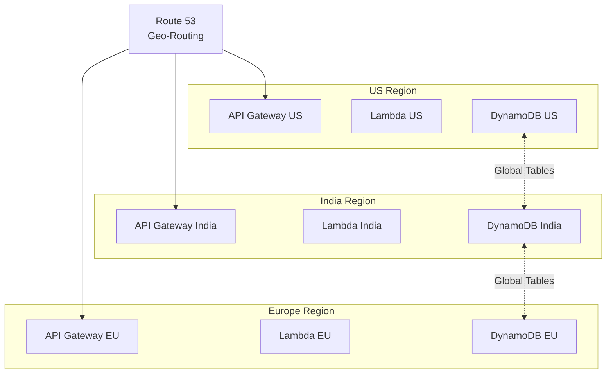

**Pattern 2: Event Processing Pipeline Scaling**
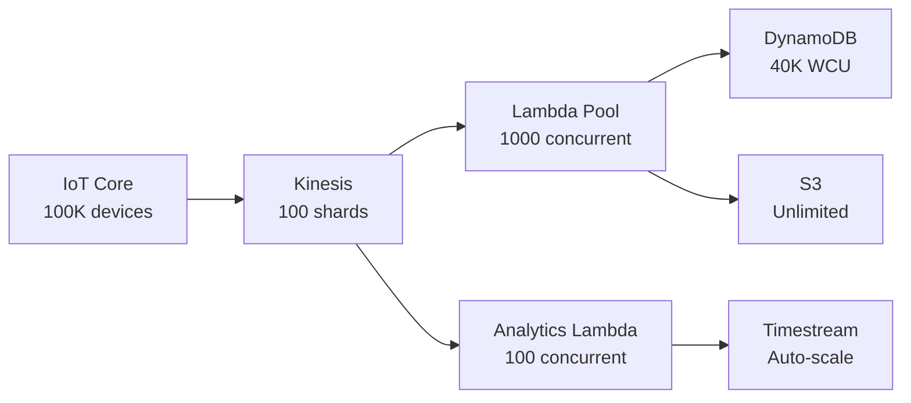

**Pattern 3: Read Scaling with Caching**
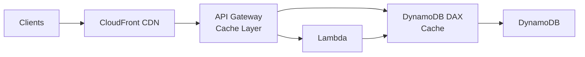

### Scaling Milestones

**Phase 1: MVP (0-100 homes)**
- Single AWS region (ap-south-1 Mumbai)
- On-demand DynamoDB billing
- Lambda reserved concurrency: 100
- Manual monitoring and optimization

**Phase 2: Early Growth (100-1,000 homes)**
- Add second region (us-east-1) for US customers
- Enable DynamoDB Global Tables
- Increase Lambda concurrency to 500
- Implement CloudFront CDN for static assets
- Add DynamoDB DAX for read caching

**Phase 3: Scale (1,000-5,000 homes)**
- Add third region (eu-west-1) for European customers
- Implement Kinesis auto-scaling
- Increase Lambda concurrency to 1,000
- Add SageMaker endpoints for custom models
- Implement multi-region failover

**Phase 4: Enterprise (5,000-10,000 homes)**
- Implement dedicated VPCs for large B2B customers
- Add AWS PrivateLink for secure connectivity
- Implement custom domain routing per clinic
- Add AWS WAF Advanced rules
- Implement AWS Shield Advanced for DDoS protection

### Performance Targets by Scale

| Scale | Homes | Events/sec | API Latency (p95) | Cost per Home/Month |
|-------|-------|------------|-------------------|---------------------|
| MVP | 100 | 100 | <500ms | $15 |
| Early Growth | 1,000 | 1,000 | <500ms | $12 |
| Scale | 5,000 | 5,000 | <500ms | $10 |
| Enterprise | 10,000 | 10,000 | <500ms | $8 |

### Cost Optimization Strategies

**Compute Optimization**:
- Use Lambda for variable workloads (auto-scaling)
- Use Fargate for steady-state workloads (analytics)
- Implement Lambda Provisioned Concurrency for latency-sensitive functions
- Use Graviton2 instances for 20% cost savings

**Storage Optimization**:
- Implement S3 Intelligent-Tiering for automatic cost optimization
- Use DynamoDB on-demand billing for unpredictable workloads
- Implement TTL for automatic data expiration
- Archive old data to Glacier Deep Archive

**Network Optimization**:
- Use VPC endpoints to avoid NAT Gateway costs
- Implement CloudFront CDN to reduce origin requests
- Use S3 Transfer Acceleration only for global uploads
- Batch API calls to reduce request costs

**Monitoring and Optimization**:
- Use AWS Cost Explorer for cost analysis
- Implement AWS Budgets for cost alerts
- Use AWS Compute Optimizer for rightsizing recommendations
- Regular review of CloudWatch metrics for optimization opportunities

### Capacity Planning

**Capacity Calculation**:
```python
def calculate_capacity(num_homes, residents_per_home, events_per_resident_per_day):
    """
    Calculate required AWS capacity for given scale.
    
    Example:
    - 1,000 homes
    - 2 residents per home average
    - 50 events per resident per day
    
    Total events per day: 1,000 * 2 * 50 = 100,000 events/day
    Events per second: 100,000 / 86,400 = 1.16 events/second average
    Peak events per second (10x average): 11.6 events/second
    """
    total_residents = num_homes * residents_per_home
    events_per_day = total_residents * events_per_resident_per_day
    avg_events_per_second = events_per_day / 86400
    peak_events_per_second = avg_events_per_second * 10  # 10x peak factor
    
    # Lambda capacity
    lambda_concurrency = peak_events_per_second * 2  # 2 seconds per invocation
    
    # DynamoDB capacity
    dynamodb_wcu = peak_events_per_second * 2  # 2 WCU per event
    dynamodb_rcu = peak_events_per_second * 10  # 10x read:write ratio
    
    # Kinesis capacity
    kinesis_shards = math.ceil(peak_events_per_second / 1000)  # 1000 events/shard/second
    
    return {
        "lambda_concurrency": lambda_concurrency,
        "dynamodb_wcu": dynamodb_wcu,
        "dynamodb_rcu": dynamodb_rcu,
        "kinesis_shards": kinesis_shards
    }
```

### Disaster Recovery and High Availability

**RTO/RPO Targets**:
- RTO (Recovery Time Objective): 15 minutes
- RPO (Recovery Point Objective): 5 minutes

**Multi-Region Failover**:
1. Primary region failure detected via Route 53 health checks
2. Route 53 automatically routes traffic to secondary region
3. DynamoDB Global Tables provide cross-region replication (RPO < 1 second)
4. Lambda functions deployed in all regions (no cold start delay)
5. S3 Cross-Region Replication for evidence packets

**Backup Strategy**:
- DynamoDB: Point-in-time recovery (35 days)
- S3: Versioning enabled, lifecycle policies for retention
- Lambda: Code stored in S3, versioned
- Configuration: Infrastructure as Code (Terraform) in Git

**Testing**:
- Monthly disaster recovery drills
- Quarterly chaos engineering exercises
- Annual full-scale failover test


## Security Architecture

### Security Overview

The AETHER system implements a **defense-in-depth security architecture** with multiple layers of protection across edge devices, network communication, cloud services, and application logic.

### Security Layers

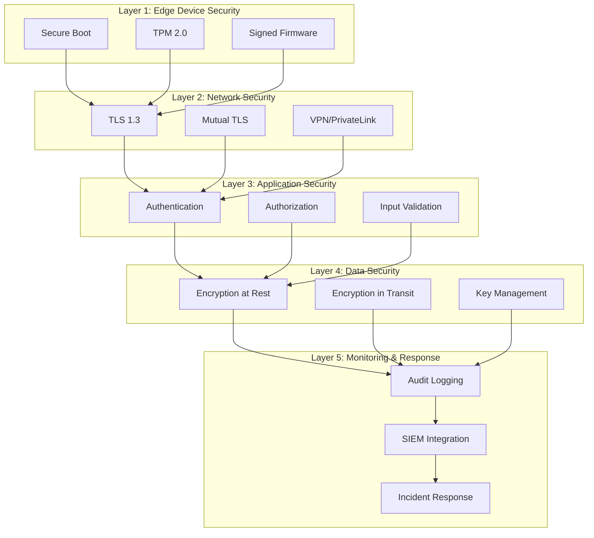

### Layer 1: Edge Device Security

**Secure Boot**:
- UEFI Secure Boot enabled on Edge Gateway
- Bootloader signature verification
- Kernel module signing enforcement
- Prevents unauthorized OS modifications

**Trusted Platform Module (TPM)**:
- TPM 2.0 chip for hardware-based security
- Secure storage of encryption keys
- Device attestation for cloud authentication
- Measured boot for integrity verification

**Firmware Security**:
- Digitally signed firmware updates
- Rollback protection (version monotonic counter)
- Secure OTA update mechanism via AWS IoT Core
- Automatic rollback on boot failure

**Physical Security**:
- Tamper-evident enclosure
- Secure element for key storage (optional)
- Debug port disabled in production
- Serial console disabled

### Layer 2: Network Security

**Transport Layer Security**:
```yaml
TLS_Configuration:
  version: TLS 1.3
  cipher_suites:
    - TLS_AES_256_GCM_SHA384
    - TLS_CHACHA20_POLY1305_SHA256
  certificate_validation: strict
  certificate_pinning: enabled
  perfect_forward_secrecy: enabled
```

**Mutual TLS (mTLS)**:
- Edge Gateway authenticates to AWS IoT Core using X.509 certificates
- AWS IoT Core authenticates to Edge Gateway
- Certificate rotation every 90 days
- Certificate revocation list (CRL) checking

**VPC Security**:
```yaml
VPC_Configuration:
  cidr: 10.0.0.0/16
  
Subnets:
  public:
    - 10.0.1.0/24 (NAT Gateway)
    - 10.0.2.0/24 (ALB)
  private:
    - 10.0.10.0/24 (Lambda)
    - 10.0.11.0/24 (Fargate)
  
Security_Groups:
  lambda_sg:
    ingress: []  # No inbound
    egress:
      - 443/tcp to VPC endpoints
      
  alb_sg:
    ingress:
      - 443/tcp from 0.0.0.0/0
    egress:
      - 443/tcp to lambda_sg
      
VPC_Endpoints:
  - com.amazonaws.region.s3 (Gateway)
  - com.amazonaws.region.dynamodb (Gateway)
  - com.amazonaws.region.iot.data (Interface)
  - com.amazonaws.region.bedrock (Interface)
```

**AWS WAF Rules**:
```yaml
WAF_Rules:
  - name: rate-limiting
    priority: 1
    action: block
    condition: requests > 2000 per 5 minutes per IP
    
  - name: sql-injection
    priority: 2
    action: block
    condition: SQL injection patterns
    
  - name: xss-protection
    priority: 3
    action: block
    condition: XSS patterns
    
  - name: geo-blocking
    priority: 4
    action: block
    condition: requests from blocked countries
    
  - name: known-bad-inputs
    priority: 5
    action: block
    condition: AWS Managed Rules - Known Bad Inputs
```

### Layer 3: Application Security

**Authentication**:
```yaml
Cognito_Configuration:
  user_pools:
    - name: aether-users
      mfa: optional (SMS or TOTP)
      password_policy:
        minimum_length: 12
        require_uppercase: true
        require_lowercase: true
        require_numbers: true
        require_symbols: true
      
  identity_pools:
    - name: aether-identities
      authenticated_role: AetherAuthenticatedRole
      unauthenticated_role: none
      
JWT_Tokens:
  access_token_expiration: 1 hour
  refresh_token_expiration: 30 days
  id_token_expiration: 1 hour
```

**Authorization**:
```yaml
IAM_Roles:
  Caregiver:
    permissions:
      - dynamodb:GetItem (residents table, own home only)
      - dynamodb:Query (events table, own home only)
      - s3:GetObject (evidence packets, own home only)
      - lambda:InvokeFunction (care-navigation, voice-processor)
    
  Nurse:
    permissions:
      - dynamodb:GetItem (residents table, assigned homes)
      - dynamodb:Query (events table, assigned homes)
      - dynamodb:UpdateItem (residents table, assigned homes)
      - s3:GetObject (evidence packets, assigned homes)
      - lambda:InvokeFunction (all functions)
    
  Clinic_Manager:
    permissions:
      - dynamodb:Query (all tables, clinic homes)
      - s3:GetObject (all evidence packets, clinic homes)
      - cloudwatch:GetMetricStatistics
      - lambda:InvokeFunction (analytics-processor)
    
  Edge_Gateway:
    permissions:
      - iot:Publish (events topic)
      - iot:Subscribe (commands topic)
      - s3:PutObject (evidence packets, own home)
      - dynamodb:PutItem (events table, own home)
```

**Input Validation**:
```python
class InputValidator:
    @staticmethod
    def validate_event(event):
        """Validate event structure and content."""
        schema = {
            "event_id": {"type": "string", "pattern": "^[a-f0-9-]{36}$"},
            "home_id": {"type": "string", "pattern": "^home_[a-z0-9]{16}$"},
            "timestamp": {"type": "integer", "minimum": 1600000000000},
            "event_type": {"type": "string", "enum": ["fall", "medication", "acoustic", ...]},
            "severity": {"type": "string", "enum": ["critical", "high", "medium", "low"]},
            "confidence": {"type": "number", "minimum": 0.0, "maximum": 1.0}
        }
        
        # Validate against schema
        validate(event, schema)
        
        # Additional business logic validation
        if event["timestamp"] > time.time() * 1000 + 60000:
            raise ValidationError("Event timestamp is in the future")
        
        if event["confidence"] < 0.5 and event["severity"] == "critical":
            raise ValidationError("Critical events must have confidence >= 0.5")
        
        return True
```

**API Security**:
- Request signing with AWS Signature Version 4
- API key rotation every 90 days
- Rate limiting per API key (1000 req/min B2C, 10000 req/min B2B)
- Request/response logging for audit
- CORS configuration for web clients

### Layer 4: Data Security

**Encryption at Rest**:
```yaml
DynamoDB_Encryption:
  encryption: AWS_MANAGED_KMS
  kms_key: arn:aws:kms:region:account:key/aether-dynamodb
  
S3_Encryption:
  default_encryption: AES256
  kms_encryption: enabled
  kms_key: arn:aws:kms:region:account:key/aether-s3
  
RDS_Encryption:
  encryption: enabled
  kms_key: arn:aws:kms:region:account:key/aether-rds
  
EBS_Encryption:
  encryption: enabled
  kms_key: arn:aws:kms:region:account:key/aether-ebs
```

**Encryption in Transit**:
- TLS 1.3 for all HTTPS connections
- TLS 1.2 minimum for MQTT connections
- Certificate pinning for mobile apps
- Perfect forward secrecy enabled

**Key Management**:
```yaml
KMS_Configuration:
  key_rotation: automatic (90 days)
  key_policy:
    - principal: Lambda execution roles
      actions: [kms:Decrypt, kms:GenerateDataKey]
    - principal: S3 service
      actions: [kms:Decrypt, kms:GenerateDataKey]
    - principal: DynamoDB service
      actions: [kms:Decrypt, kms:GenerateDataKey]
  
  key_aliases:
    - alias/aether-dynamodb
    - alias/aether-s3
    - alias/aether-rds
    - alias/aether-ebs
```

**Field-Level Encryption**:
```python
class FieldEncryption:
    def __init__(self, kms_client):
        self.kms = kms_client
    
    def encrypt_phi(self, data):
        """Encrypt PHI fields separately from other data."""
        phi_fields = ["name", "date_of_birth", "phone", "email", "address"]
        
        encrypted_data = data.copy()
        for field in phi_fields:
            if field in data:
                # Generate data key
                response = self.kms.generate_data_key(
                    KeyId="alias/aether-phi",
                    KeySpec="AES_256"
                )
                
                # Encrypt field value
                cipher = AES.new(response["Plaintext"], AES.MODE_GCM)
                ciphertext, tag = cipher.encrypt_and_digest(data[field].encode())
                
                # Store encrypted value with metadata
                encrypted_data[field] = {
                    "ciphertext": base64.b64encode(ciphertext).decode(),
                    "tag": base64.b64encode(tag).decode(),
                    "nonce": base64.b64encode(cipher.nonce).decode(),
                    "encrypted_key": base64.b64encode(response["CiphertextBlob"]).decode()
                }
        
        return encrypted_data
```

### Layer 5: Monitoring and Incident Response

**Audit Logging**:
```yaml
CloudTrail:
  enabled: true
  multi_region: true
  log_file_validation: enabled
  s3_bucket: aether-audit-logs
  sns_topic: aether-security-alerts
  
CloudWatch_Logs:
  retention: 90 days
  encryption: enabled
  log_groups:
    - /aws/lambda/event-processor
    - /aws/lambda/escalation-handler
    - /aws/apigateway/aether-api
    - /aws/iot/aether-devices
```

**Security Monitoring**:
```yaml
GuardDuty:
  enabled: true
  finding_publishing_frequency: FIFTEEN_MINUTES
  
SecurityHub:
  enabled: true
  standards:
    - AWS Foundational Security Best Practices
    - CIS AWS Foundations Benchmark
    - PCI DSS
  
Config:
  enabled: true
  rules:
    - encrypted-volumes
    - s3-bucket-public-read-prohibited
    - iam-password-policy
    - mfa-enabled-for-iam-console-access
```

**Incident Response**:
```yaml
Incident_Response_Plan:
  detection:
    - GuardDuty findings
    - SecurityHub alerts
    - CloudWatch alarms
    - Manual reports
  
  classification:
    - P1: Data breach, system compromise
    - P2: Unauthorized access attempt
    - P3: Policy violation
    - P4: Informational
  
  response:
    P1:
      - Isolate affected resources (within 15 minutes)
      - Notify security team (immediate)
      - Notify affected users (within 24 hours)
      - Engage forensics team
      - Notify regulators (within 72 hours if required)
    
    P2:
      - Investigate and contain (within 1 hour)
      - Notify security team
      - Review access logs
      - Implement additional controls
    
    P3:
      - Investigate (within 24 hours)
      - Document findings
      - Update policies
    
    P4:
      - Log for review
      - No immediate action required
```

**Penetration Testing**:
- Annual third-party penetration testing
- Quarterly internal security assessments
- Continuous automated vulnerability scanning
- Bug bounty program for responsible disclosure

**Compliance**:
- HIPAA compliance audit (annual)
- SOC 2 Type II certification (annual)
- GDPR compliance review (annual)
- Indian data protection compliance (ongoing)


## Error Handling

### Edge Gateway Failures

**Scenario**: Edge Gateway becomes unresponsive or crashes

**Handling**:
- Watchdog timer restarts Edge Gateway after 60 seconds of unresponsiveness
- Sensor nodes queue events locally (up to 1000 events)
- Critical sensors (wearable IMU) trigger local siren if no gateway heartbeat for 5 minutes
- AWS IoT Core detects offline gateway and notifies operations team
- Events sync automatically when gateway recovers

**Fail-Safe**: Local siren activation ensures emergency response even without cloud connectivity

### Cloud Connectivity Loss

**Scenario**: Internet connection fails or AWS services unavailable

**Handling**:
- Edge Gateway switches to offline mode automatically
- Fall detection, voice commands, and medication reminders continue locally
- Events queued in local DynamoDB Lite (SQLite)
- Care Navigation uses cached Knowledge Pack
- Voice processing uses local NVIDIA Riva (if available) or cached responses
- Escalation Ladder uses SMS/phone calls (cellular backup)

**Recovery**: Automatic sync when connectivity restored, with conflict resolution for overlapping events

### Sensor Failures

**Scenario**: Individual sensor stops responding or provides invalid data

**Handling**:
- Sensor health monitoring detects missing heartbeats (30 second timeout)
- Multi-sensor fusion compensates for missing signals (graceful degradation)
- System health alert generated for persistent sensor failures (> 1 hour)
- Confidence scores adjusted based on available sensors
- Operations console shows sensor status for all deployments

**Fail-Safe**: Fall detection continues with reduced confidence using remaining sensors

### LLM Service Failures

**Scenario**: AWS Bedrock API unavailable or rate-limited

**Handling**:
- Retry with exponential backoff (3 attempts: 1s, 2s, 4s delays)
- Fallback to local Gemma model on Edge Gateway for basic queries
- Cached responses for common queries (medication reminders, check-ins)
- Graceful degradation: "Service temporarily unavailable, please try again"
- Critical safety functions (fall detection, escalation) unaffected

**Monitoring**: CloudWatch alarms for API error rates > 5%

### Voice Recognition Failures

**Scenario**: Wake word not detected or ASR produces incorrect transcription

**Handling**:
- Multiple wake word attempts allowed (no lockout)
- Low confidence transcriptions prompt clarification: "Did you say [command]?"
- Manual fallback via mobile app for critical commands
- Voice recognition confidence logged for model improvement
- Alternative input methods always available (app, physical buttons)

**User Feedback**: "I didn't understand that. Please try again or use the app."


### Data Corruption

**Scenario**: Event data corrupted during transmission or storage

**Handling**:
- JSON schema validation on all Event objects before storage
- Checksum verification for Evidence Packets in S3
- DynamoDB point-in-time recovery enabled (35 day window)
- Invalid events logged to dead-letter queue for manual review
- Automatic retry for transient corruption (network errors)

**Detection**: Schema validation failures trigger alerts to operations team

### False Positive Escalation

**Scenario**: System generates false alarm (e.g., TV sound detected as scream)

**Handling**:
- Voice cancellation: "Cancel alert" immediately halts escalation
- Caregiver feedback: "False alarm" button in app
- Adaptive thresholds: System learns from false alarm patterns
- Confidence gating: Lower confidence events require voice check-in
- Weekly false alarm reports for threshold tuning

**Learning**: False alarm feedback incorporated into model retraining (federated learning)

### Privacy Violations

**Scenario**: Raw audio/video accidentally transmitted or stored

**Handling**:
- Privacy layer enforced at edge (feature extraction only)
- Network monitoring detects unexpected data volumes
- Automatic alerts for privacy policy violations
- Audit trail of all data transmissions
- Immediate investigation and remediation for violations

**Prevention**: Privacy-by-design architecture with multiple safeguards

### Multi-Resident Misattribution

**Scenario**: Event attributed to wrong resident in multi-profile household

**Handling**:
- Manual correction in caregiver app
- Correction propagates to all related events
- Voice recognition confidence logged for improvement
- Fallback to manual identification when confidence < 0.80
- Audit trail of all attribution changes

**Mitigation**: Clear voice prompts "Who is speaking?" when uncertain

### Medication Errors

**Scenario**: Wrong medication identified or dosage confusion

**Handling**:
- NFC tag validation against medication database
- Two-person integrity for high-risk medication changes
- Voice confirmation with medication name readback
- Pharmacist review for new medications
- Clear disclaimers: System tracks adherence, does not dispense

**Safety**: System never controls medication access or dosing


## Testing Strategy

### Dual Testing Approach

The AETHER system requires both unit testing and property-based testing for comprehensive coverage:

- **Unit tests**: Verify specific examples, edge cases, error conditions, and integration points
- **Property tests**: Verify universal properties across all inputs using randomized testing

Both approaches are complementary and necessary. Unit tests catch concrete bugs in specific scenarios, while property tests verify general correctness across the input space.

### Property-Based Testing Configuration

**Framework**: fast-check (TypeScript/JavaScript) or Hypothesis (Python)

**Configuration**:
- Minimum 100 iterations per property test (due to randomization)
- Each property test must reference its design document property
- Tag format: `Feature: aether-elderly-care-system, Property {number}: {property_text}`

**Example Property Test**:
```typescript
import fc from 'fast-check';

// Feature: aether-elderly-care-system, Property 1: Event Serialization Round-Trip
test('Event serialization round-trip preserves data', () => {
  fc.assert(
    fc.property(
      eventArbitrary(),  // Generator for random valid Events
      (event) => {
        const serialized = serializeEvent(event);
        const deserialized = deserializeEvent(serialized);
        expect(deserialized).toEqual(event);
      }
    ),
    { numRuns: 100 }
  );
});
```

### Unit Testing Strategy

**Focus Areas**:
1. **Specific Examples**: Test concrete scenarios from requirements (e.g., "cancel alert" command)
2. **Edge Cases**: Empty strings, maximum field lengths, boundary conditions
3. **Error Conditions**: Invalid inputs, network failures, sensor malfunctions
4. **Integration Points**: AWS service interactions, MQTT communication, database operations

**Coverage Targets**:
- Line coverage: 80% minimum
- Branch coverage: 75% minimum
- Critical paths (fall detection, escalation): 95% minimum

**Example Unit Test**:
```typescript
// Test specific command recognition
test('Voice Agent recognizes "cancel alert" command', async () => {
  const voiceAgent = new VoiceAgent();
  const audio = loadTestAudio('cancel_alert.wav');
  const command = await voiceAgent.processCommand(audio);
  expect(command.type).toBe('CANCEL_ALERT');
});
```

### Integration Testing

**Test Environments**:
1. **Local**: Docker Compose with LocalStack (AWS services), MQTT broker, mock sensors
2. **Staging**: AWS staging environment with real services, synthetic data
3. **Production**: Canary deployments with real-time monitoring

**Key Integration Tests**:
- End-to-end fall detection: Wearable IMU → Edge Gateway → AWS → Caregiver notification
- Voice interaction flow: Wake word → ASR → LLM → TTS → Response
- Offline resilience: Disconnect network, verify local operation, reconnect, verify sync
- Multi-sensor fusion: Combine IMU + pose + acoustic signals, verify confidence calculation
- Escalation ladder: Trigger event, verify tier progression and timeouts


### Performance Testing

**Load Testing**:
- Simulate 100 concurrent homes with 4 residents each
- Generate 1000 events per second across all homes
- Measure: API latency (p50, p95, p99), DynamoDB throughput, Lambda cold starts
- Target: p95 latency < 500ms for event processing

**Stress Testing**:
- Gradually increase load until system degradation
- Identify bottlenecks and scaling limits
- Verify graceful degradation under overload
- Target: Handle 2x expected peak load

**Endurance Testing**:
- Run system continuously for 7 days
- Monitor for memory leaks, resource exhaustion
- Verify data retention and cleanup policies
- Target: No degradation over 7-day period

### Security Testing

**Penetration Testing**:
- OWASP Top 10 vulnerability scanning
- Network penetration testing of edge devices
- API security testing (authentication, authorization, injection)
- IoT device security assessment

**Red Team Testing**:
- 500+ adversarial prompts for LLM safety
- Prompt injection attempts
- Jailbreaking attempts
- Medical misinformation generation attempts
- Target: 99% refusal rate on adversarial prompts

**Privacy Testing**:
- Verify no raw audio/video transmission (network monitoring)
- Test data encryption at rest and in transit
- Verify data isolation between residents
- Test consent enforcement and data deletion

### Synthetic Data Testing

**Digital Twin Scenarios**:
1. **Normal Aging**: Gradual routine changes, occasional minor events
2. **Acute Event**: Sudden fall, immediate response required
3. **Gradual Decline**: Slow deterioration in activity, sleep, nutrition
4. **Multi-Resident**: Complex interactions, voice recognition challenges
5. **Sensor Failures**: Degraded sensor coverage, fusion compensation

**Dataset Generation**:
- Use NVIDIA Omniverse for 3D simulation
- Generate 90 days of data per scenario in 15 minutes
- Include realistic noise, sensor drift, occasional failures
- Label all data with ground truth for supervised learning

**Public Dataset Integration**:
- SisFall: 4,510 ADL and fall trials from 38 subjects
- MobiFall: 2,520 ADL and fall trials from 24 subjects
- Use for fall detection model training and validation
- Augment with synthetic data from Digital Twin

### Acceptance Testing

**MVP Success Criteria**:
1. Detect simulated falls with 90% accuracy in demo environment
2. Deliver alerts to caregiver mobile app within 20 seconds of fall detection
3. Generate readable daily summary from 24 hours of synthetic sensor events
4. Demonstrate offline fall detection and event queuing
5. Complete end-to-end demo from fall detection through caregiver notification
6. Show privacy-preserving architecture with no video transmission
7. Deploy working prototype on Jetson Orin Nano or Raspberry Pi 5

**User Acceptance Testing**:
- Beta deployment with 10 volunteer families
- Collect feedback on usability, false alarm rates, response times
- Measure: NPS score, daily active usage, caregiver satisfaction
- Iterate based on feedback before general availability

### Continuous Testing

**CI/CD Pipeline**:
1. **Commit**: Unit tests, linting, type checking
2. **PR**: Integration tests, property tests, security scans
3. **Staging**: End-to-end tests, performance tests, red team tests
4. **Production**: Canary deployment, real-time monitoring, rollback capability

**Monitoring in Production**:
- Real-time dashboards: Event volume, latency, error rates, false alarms
- Alerting: CloudWatch alarms for anomalies
- Incident response: On-call rotation, runbooks, post-mortems
- Continuous improvement: Weekly metrics review, monthly model retraining


## Functional Requirements Summary

The AETHER system implements 104 detailed functional requirements organized into the following categories:

### Voice Interaction (Requirements 1-3)
- Wake-word detection ("Hey Sentinel", "Hey AETHER") with <1s activation latency
- Voice command processing (cancel alert, I need help, check medication, I'm okay, remind me later)
- Multi-language support (English, Spanish, Hindi, Kannada, Mandarin)

### Acoustic Event Detection (Requirements 4-9)
- Scream detection (confidence threshold: 0.85)
- Glass break detection (threshold: 0.80)
- Prolonged silence detection (< 30dB for 4+ hours during daytime)
- Coughing and respiratory distress monitoring (20+ events/hour for 2 hours)
- Doorbell and phone ring detection with response tracking
- Impact sound detection with acoustic triangulation

### Fall Detection (Requirements 10-12)
- Multi-sensor fusion (wearable IMU + pose estimation + acoustic)
- Post-fall immobility detection (60 second threshold)
- Rapid triage voice flow ("Are you okay?")
- Confidence-based escalation (0.90+ immediate, 0.70-0.90 voice check-in)

### Medication Management (Requirements 13-18)
- Voice-confirmed medication reminders with custom naming
- NFC tag identification for medication tracking
- Configurable escalation timeouts based on criticality
- Medication confusion loop detection (3+ opens without removal)
- Two-person integrity for high-risk medication changes

### Daily Check-Ins and Health Monitoring (Requirements 19-21)
- Daily dialogue system (mood, pain, sleep, hydration)
- Trend flagging for declining metrics (30% decline over 7 days)
- Comprehension checks for patient education (teach-back methodology)

### Care Navigation and Education (Requirements 22-26)
- Evidence-linked care navigation using Amazon Q and RAG
- Offline-capable guidance with cached Knowledge Packs
- Patient education micro-lessons (2-3 minutes)
- Local-language caregiver coaching (Hindi, Kannada)

### Clinical Documentation (Requirements 27-30)
- SOAP-like documentation generation from Timeline events
- Nurse review and sign-off workflow
- Automated incident packet generation (<10 seconds)
- Pre-consultation summaries for telehealth

### LLM Safety (Requirements 31-35)
- Retrieval-limited responses (RAG with vetted Knowledge Packs)
- "Unknown" behavior for out-of-scope queries
- Hard constraints preventing invented medical claims
- Red-teaming harness with 500+ adversarial prompts (99% refusal rate)
- Compliance-grade audit trail of all LLM outputs

### Multi-Profile Support (Requirements 36-38)
- Up to 4 resident profiles per household
- Per-resident voice recognition (confidence > 0.80)
- Individual permissions and privacy settings

### Social Features (Requirements 39-41)
- Proactive loneliness reduction with companion conversations
- Family voice postcards (2-minute recordings)
- Opt-in boundaries for all social features

### Routine Modeling (Requirements 42-43)
- Ambient routine learning (14-day baseline)
- Drift detection (2+ hour changes for 3 consecutive days)
- Confidence-aware escalation based on multi-signal fusion

### B2B Operations (Requirements 44-47)
- Clinic operations console for multi-home monitoring
- Response latency tracking (Caregiver: 5 min, Nurse: 10 min SLAs)
- Alert volume and false alarm rate metrics
- Multi-dwelling facility management (up to 500 residents)

### Testing and Simulation (Requirements 48-49)
- Digital Twin simulator (90 days in 15 minutes)
- Public dataset integration (SisFall, MobiFall)


## Non-Functional Requirements

### Security Requirements

**Authentication and Authorization**:
- AWS Cognito for user authentication with MFA support
- JWT tokens for API authentication with 1-hour expiration
- Role-based access control (RBAC) for caregivers, nurses, clinic managers
- X.509 certificates for Edge Gateway authentication to AWS IoT Core

**Data Encryption**:
- TLS 1.3 for all data in transit
- AWS KMS for encryption key management with 90-day rotation
- AES-256 encryption for data at rest (S3, DynamoDB)
- End-to-end encryption for voice postcards

**Network Security**:
- VPC isolation for cloud resources
- Security groups restricting inbound traffic
- AWS WAF for API Gateway protection
- DDoS protection via AWS Shield

**IoT Security**:
- Device certificates for MQTT authentication
- MQTT over TLS for sensor communication
- Firmware signing and verification
- Secure boot on Edge Gateway

**Compliance**:
- HIPAA compliance for PHI handling
- GDPR compliance for EU deployments
- Indian healthcare data regulations (Digital Personal Data Protection Act)
- SOC 2 Type II certification target

### Reliability Requirements

**Availability**:
- System uptime: 99.5% for critical safety functions
- Edge Gateway uptime: 99.9% with watchdog recovery
- Cloud services: 99.95% (AWS SLA)
- Planned maintenance windows: < 4 hours/month

**Fault Tolerance**:
- Multi-AZ deployment for AWS services
- Automatic failover for critical components
- Graceful degradation when sensors fail
- Offline operation for up to 7 days

**Data Durability**:
- S3: 99.999999999% (11 nines) durability
- DynamoDB: Point-in-time recovery (35 days)
- Event queue: No data loss during network outages
- Backup retention: 90 days for events, 7 years for critical incidents

**Recovery**:
- RTO (Recovery Time Objective): 15 minutes for cloud services
- RPO (Recovery Point Objective): 5 minutes for event data
- Automated disaster recovery procedures
- Regular backup testing (monthly)

### Performance Requirements

**Latency**:
- Wake word detection to Voice Agent activation: < 1 second
- Fall detection to alert generation: < 5 seconds
- Alert generation to caregiver notification: < 15 seconds
- Voice command processing: < 2 seconds end-to-end
- Timeline query (30 days): < 500ms
- Incident packet generation: < 10 seconds
- NFC tag reading: < 1 second
- Fall detection inference (Jetson): < 500ms

**Throughput**:
- Events per second: 1000+ across all homes
- MQTT connections: 50+ per Edge Gateway
- Concurrent API requests: 10,000+ (auto-scaling)
- Kinesis stream: 1000+ events/second

**Resource Utilization**:
- Edge Gateway CPU: < 70% average utilization
- Edge Gateway memory: < 80% utilization
- Acoustic Sentinel power: < 100mW per node
- Jetson Orin Nano power: < 15W for pose estimation at 30 FPS
- Wearable battery life: 18+ months

**Scalability**:
- Horizontal scaling: Support 10,000+ homes
- Vertical scaling: Support 500 residents per facility
- Database scaling: Auto-scaling for DynamoDB
- Lambda concurrency: 1000+ concurrent executions


### Privacy Requirements

**Data Minimization**:
- Extract features at edge, transmit only necessary data
- Audio: Spectral features only (MFCC, mel-spectrogram), no raw audio by default
- Video: Pose keypoints only (17-point skeleton), no frame storage
- Wearable: Acceleration patterns, not raw sensor samples
- Default: No raw audio/video transmission to cloud

**Consent Management**:
- Explicit opt-in for raw audio recording
- Per-sensor enable/disable toggles
- Granular consent for data sharing with caregivers/clinicians
- Immutable consent ledger with audit trail
- Easy consent withdrawal at any time

**Data Retention**:
- Configurable retention periods: 30/90/365/2555 days
- Automatic deletion within 24 hours of expiration
- Critical safety events: 7-year retention for regulatory compliance
- Data export in JSON/CSV formats
- Complete data deletion within 30 days of request

**Access Control**:
- Multi-profile data isolation (no cross-resident access)
- Caregiver access requires resident consent
- Audit trail of all data access
- Temporary access grants with expiration
- Emergency access override with logging

**Privacy by Design**:
- Edge-first processing architecture
- Feature extraction on device (not cloud)
- Encrypted data transmission and storage
- Privacy impact assessments for new features
- Regular privacy audits

### Usability Requirements

**Ease of Use**:
- System setup: < 20 minutes for 90% of installations
- Voice-first interaction (no app required for seniors)
- Clear audio feedback for all voice commands
- Simple caregiver mobile app (< 5 screens)
- One-click emergency contact

**Accessibility**:
- Voice interaction for mobility-impaired users
- Multi-language support (5 languages)
- Large text and high contrast in apps
- Screen reader compatibility
- Alternative input methods (voice, touch, physical buttons)

**User Experience**:
- Natural language voice interaction
- Minimal false alarms (< 2 per week after learning period)
- Clear escalation notifications
- Intuitive timeline visualization
- Responsive mobile app (< 2 second load time)

### Maintainability Requirements

**Monitoring**:
- Real-time dashboards for system health
- CloudWatch metrics and alarms
- Distributed tracing with AWS X-Ray
- Log aggregation and search
- Automated anomaly detection

**Deployment**:
- Infrastructure as Code (Terraform/CloudFormation)
- CI/CD pipeline with automated testing
- Blue-green deployments for zero downtime
- Canary deployments for gradual rollout
- Automated rollback on errors

**Documentation**:
- API documentation (OpenAPI/Swagger)
- Architecture decision records (ADRs)
- Runbooks for common operations
- Troubleshooting guides
- User manuals in multiple languages

**Updates**:
- Over-the-air (OTA) firmware updates for Edge Gateway
- Model updates via AWS SageMaker
- Knowledge Pack updates (quarterly)
- Security patches within 48 hours of disclosure
- Feature updates with backward compatibility


## Safety Constraints

The AETHER system implements strict safety constraints to ensure patient safety and regulatory compliance:

### Emergency Response Constraints

1. **Non-Blocking Emergency Contact**: The system SHALL never prevent or delay emergency services contact when requested by any user
2. **Fall Detection Priority**: Fall detection capability SHALL be maintained as highest priority function that cannot be disabled
3. **Fail-Safe Escalation**: System failures SHALL result in alert escalation rather than silence (fail-safe defaults)
4. **Manual Override**: The system SHALL provide manual override capabilities for all automated escalation decisions

### Medical Safety Constraints

5. **No Diagnosis**: The system SHALL display prominent disclaimers that AI outputs are advisory only and not medical diagnoses
6. **No Medication Control**: The system SHALL never automatically administer medication or control medical devices
7. **No Treatment Decisions**: The system SHALL not make treatment decisions or recommend specific medications/dosages
8. **Vetted Knowledge Only**: LLM responses SHALL be limited to vetted Knowledge Pack content (no hallucinations)

### Data Safety Constraints

9. **Tamper-Proof Logging**: The system SHALL log all emergency events with tamper-proof timestamps for liability protection
10. **Audit Trail**: All LLM queries, responses, and guardrail actions SHALL be logged for compliance review
11. **Consent Enforcement**: The system SHALL enforce consent requirements before any data sharing
12. **Privacy Preservation**: Raw audio/video SHALL NOT be transmitted by default (feature extraction only)

### Operational Safety Constraints

13. **Safety Validation**: The system SHALL undergo safety validation testing before deployment in production environments
14. **Red Team Testing**: The system SHALL achieve 99% refusal rate on adversarial prompts before release
15. **Quiet Hours Override**: Critical safety events (falls, distress) SHALL always escalate regardless of quiet hours settings
16. **Graceful Degradation**: The system SHALL maintain fall detection and emergency response even with minimal sensors

### Regulatory Constraints

17. **HIPAA Compliance**: All PHI handling SHALL comply with HIPAA regulations
18. **GDPR Compliance**: Data processing SHALL comply with GDPR for EU deployments
19. **Indian Regulations**: The system SHALL comply with Indian healthcare data protection regulations
20. **Medical Device Classification**: The system SHALL be classified as wellness device (not medical device) to avoid FDA/CE marking requirements


## Success Metrics

### Primary Metrics

**1. Fall Detection Accuracy**
- Target: 95% true positive rate
- Target: < 5% false positive rate
- Measurement: Comparison with ground truth from Digital Twin and beta testing
- Timeline: Achieve targets within 3 months of deployment

**2. Emergency Response Time**
- Target: < 15 seconds average from fall detection to caregiver notification
- Measurement: End-to-end latency tracking in CloudWatch
- Timeline: Maintain target for 95% of events

**3. System Uptime**
- Target: 99.5% uptime for critical safety functions over 90-day periods
- Measurement: CloudWatch availability metrics
- Timeline: Continuous monitoring with monthly reports

**4. User Adoption**
- Target: 80% daily active usage rate among deployed seniors within 30 days of setup
- Measurement: Daily voice interactions, check-in completions, sensor activity
- Timeline: Track weekly for first 90 days

**5. Alert Response Rate**
- Target: 90% caregiver acknowledgment of alerts within 5 minutes
- Measurement: Escalation Ladder tracking in DynamoDB
- Timeline: Monthly reporting with trend analysis

### Secondary Metrics

**6. Medication Adherence Improvement**
- Target: 20% improvement in medication adherence rates compared to baseline
- Measurement: Medication event tracking over 90 days
- Timeline: Compare months 1-3 vs. baseline

**7. False Alarm Rate**
- Target: < 2 false alarms per week per installation after learning period
- Measurement: Caregiver feedback and event classification
- Timeline: Achieve target by day 30 post-installation

**8. User Satisfaction**
- Target: Net Promoter Score (NPS) > 50 from seniors and caregivers
- Measurement: Quarterly surveys
- Timeline: First survey at 90 days post-installation

**9. Clinical Utility**
- Target: 75% of care professionals agree that AETHER insights improve care decisions
- Measurement: Clinician surveys and interviews
- Timeline: Quarterly assessment

**10. Privacy Compliance**
- Target: Zero privacy violations or unauthorized data access incidents
- Measurement: Security audit logs and incident reports
- Timeline: Continuous monitoring with monthly reviews

### Operational Metrics

**11. Setup Time**
- Target: < 20 minutes for 90% of installations
- Measurement: Installation time tracking in mobile app
- Timeline: Track for first 100 installations

**12. Battery Life**
- Target: 18+ months for SenseMesh devices under typical usage
- Measurement: Battery level monitoring and replacement tracking
- Timeline: Long-term tracking over 24 months

**13. Data Synchronization**
- Target: 99% successful synchronization rate for offline-queued events
- Measurement: Sync success/failure logs in CloudWatch
- Timeline: Weekly monitoring

**14. Model Performance**
- Target: 85% relevance rating from care professionals for AI-generated insights
- Measurement: Clinician feedback on documentation and triage cards
- Timeline: Monthly assessment

**15. Support Burden**
- Target: < 24 hours average support ticket resolution time
- Measurement: Support ticket system tracking
- Timeline: Weekly reporting

### Business Metrics

**16. Customer Acquisition Cost (CAC)**
- Target: < $500 per B2C customer, < $5000 per B2B clinic
- Measurement: Marketing spend / new customers
- Timeline: Quarterly review

**17. Monthly Recurring Revenue (MRR)**
- Target: $50/month per B2C home, $500/month per B2B clinic
- Measurement: Subscription revenue tracking
- Timeline: Monthly reporting

**18. Churn Rate**
- Target: < 5% monthly churn for B2C, < 2% for B2B
- Measurement: Subscription cancellations / active subscriptions
- Timeline: Monthly tracking

**19. Net Revenue Retention (NRR)**
- Target: > 100% (expansion revenue from upsells)
- Measurement: Revenue from existing customers over time
- Timeline: Quarterly calculation

**20. Time to Value**
- Target: First successful fall detection within 7 days of installation
- Measurement: Days from installation to first critical event detection
- Timeline: Track for all installations


## MVP Scope for 2-Week Hackathon

### MVP Objectives

Build a working prototype demonstrating core safety features with AWS and NVIDIA integration:
- Fall detection with multi-sensor fusion
- Voice-first interaction with wake-word
- Acoustic event detection (scream, glass break)
- Emergency escalation with mobile app notifications
- Privacy-preserving edge processing
- Offline-capable operations

### In Scope for MVP

**Core Features**:
1. Edge-based fall detection (wearable IMU + pose estimation fusion)
2. Voice-first interaction with wake-word detection
3. Acoustic event detection (scream, glass break, prolonged silence)
4. Medication adherence tracking with voice confirmations
5. Daily check-in dialogue system
6. Emergency escalation ladder (local siren → caregiver notification)
7. Caregiver mobile app with timeline view
8. Care navigation assistant with LLM guardrails
9. Synthetic data simulator for demo
10. Multi-language support (English, Hindi)

**Technical Stack**:
- Edge: Raspberry Pi 5 or Jetson Orin Nano
- Cloud: AWS (IoT Core, Lambda, DynamoDB, S3, Bedrock, Transcribe, Polly)
- Mobile: React Native app for caregivers
- Sensors: Simulated sensors (no physical hardware required)

### Out of Scope for MVP

- Physical sensor hardware (use simulated data)
- Full clinic operations console (basic monitoring only)
- Complete telehealth integration
- Advanced analytics and predictive modeling
- Federated learning
- Full WCAG AA accessibility compliance
- Additional languages beyond English and Hindi
- Production-grade security hardening
- Comprehensive error handling for all edge cases

### MVP Success Criteria

1. ✅ Detect simulated falls with 90% accuracy in demo environment
2. ✅ Deliver alerts to caregiver mobile app within 20 seconds of fall detection
3. ✅ Generate readable daily summary from 24 hours of synthetic sensor events
4. ✅ Demonstrate offline fall detection and event queuing
5. ✅ Complete end-to-end demo from fall detection through caregiver notification
6. ✅ Show privacy-preserving architecture with feature extraction (no raw data transmission)
7. ✅ Deploy working prototype on Raspberry Pi 5 or Jetson Orin Nano


### 2-Week Development Plan

#### Week 1: Foundation and Core Infrastructure

**Day 1-2: Project Setup and Architecture**
- Set up AWS account and configure services (IoT Core, Lambda, DynamoDB, S3, Bedrock)
- Create project repositories (edge, cloud, mobile)
- Set up CI/CD pipeline with GitHub Actions
- Configure development environments
- Design data models and API contracts
- Set up Raspberry Pi 5 or Jetson Orin Nano development board

**Day 3-4: Edge Gateway and Sensor Simulation**
- Implement Edge Gateway core (Python/Node.js)
- Create sensor simulators (IMU, acoustic, pose estimation)
- Implement MQTT broker and sensor communication
- Build fall detection fusion engine
- Implement local event queue for offline resilience
- Test multi-sensor fusion with simulated data

**Day 5-7: Cloud Backend and Event Processing**
- Implement AWS IoT Core device registration and authentication
- Build Lambda functions for event processing
- Create DynamoDB tables for events and timeline
- Implement S3 storage for evidence packets
- Build escalation ladder logic with Step Functions
- Integrate AWS Bedrock for LLM services
- Test end-to-end event flow from edge to cloud

#### Week 2: Voice Interaction, Mobile App, and Integration

**Day 8-9: Voice Interaction System**
- Implement wake-word detection (Porcupine or custom model)
- Integrate AWS Transcribe for speech recognition
- Build voice command processor
- Integrate AWS Polly for text-to-speech
- Implement daily check-in dialogue system
- Test voice interaction flow with simulated audio

**Day 10-11: Caregiver Mobile App**
- Build React Native mobile app skeleton
- Implement authentication with AWS Cognito
- Create timeline view with event cards
- Build alert notification system (push notifications)
- Implement alert acknowledgment and response
- Test mobile app with cloud backend

**Day 12-13: Care Navigation and LLM Safety**
- Integrate AWS Bedrock with Guardrails
- Create Knowledge Pack with vetted medical content
- Implement RAG for care navigation queries
- Build LLM safety layer with content filters
- Test adversarial prompts and refusal behavior
- Implement audit logging for LLM interactions

**Day 14: Integration, Testing, and Demo Preparation**
- End-to-end integration testing
- Performance testing and optimization
- Bug fixes and polish
- Prepare demo scenarios (fall detection, voice interaction, escalation)
- Create demo video and presentation
- Deploy to demo environment
- Final rehearsal and documentation

### MVP Deliverables

**Code Repositories**:
1. `aether-edge`: Edge Gateway code (Python/Node.js)
2. `aether-cloud`: AWS Lambda functions and infrastructure (Terraform/CloudFormation)
3. `aether-mobile`: Caregiver mobile app (React Native)
4. `aether-simulator`: Synthetic data generator and Digital Twin

**Documentation**:
1. Architecture diagram and design document
2. API documentation (OpenAPI spec)
3. Setup and deployment guide
4. Demo script and user guide
5. Video demo (5 minutes)

**Demo Environment**:
1. Working Edge Gateway on Raspberry Pi 5 or Jetson Orin Nano
2. AWS cloud infrastructure (staging environment)
3. Caregiver mobile app (iOS/Android)
4. Synthetic data simulator generating realistic scenarios

**Metrics Dashboard**:
1. Real-time event monitoring
2. Fall detection accuracy
3. Response time tracking
4. System health indicators

### Post-MVP Roadmap

**Month 1-2: Beta Testing**
- Deploy to 10 volunteer families
- Collect feedback and iterate
- Improve false alarm rates
- Enhance voice recognition accuracy

**Month 3-4: B2B Features**
- Build clinic operations console
- Implement multi-home monitoring
- Add SLA tracking and reporting
- Develop staff workload management

**Month 5-6: Advanced Features**
- Federated learning for privacy-preserving model updates
- Advanced analytics and predictive modeling
- Telehealth integration
- Additional language support (Spanish, Kannada, Mandarin)

**Month 7-12: Scale and Compliance**
- Production security hardening
- HIPAA and GDPR compliance certification
- Scale testing (1000+ homes)
- Regulatory approvals for India market
- Commercial launch

