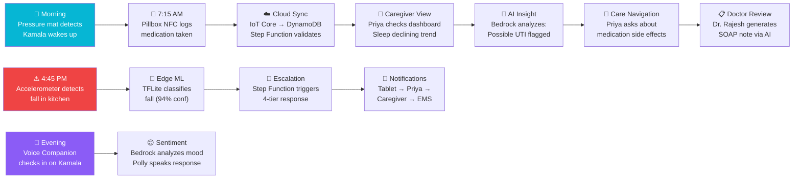
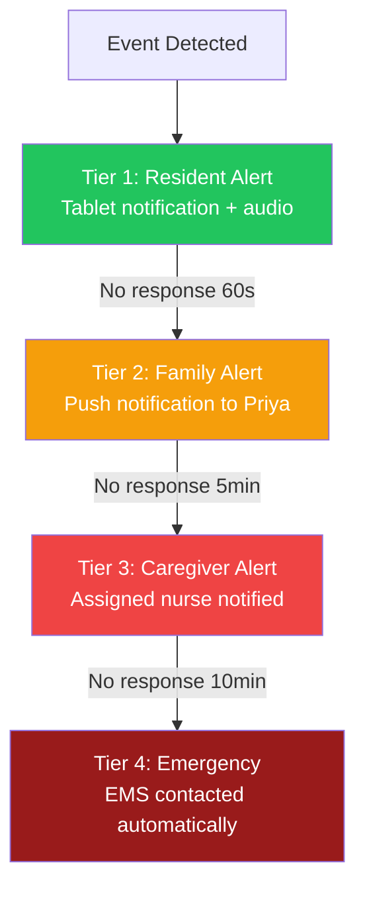

# Adobe Creative Studio — Presentation Prompt

Copy the entire block below into Adobe Creative Studio (or any AI presentation generator) to generate your hackathon slides.

---

````
Create a professional, modern hackathon presentation for a project called "AETHER — Autonomous Elderly ecosystem for Total Health, Engagement & Response". This is an AI-powered elderly care operating system built on AWS, submitted to a GenAI Hackathon (March 2026). Use a clean dark-themed design with teal/cyan (#06B6D4) and amber (#F59E0B) as accent colors on a deep navy (#0F172A) background. Use modern sans-serif fonts. The presentation should feel like a polished tech startup pitch, not a college project.

Generate the following 11 slides:

---

## SLIDE 1: Title Slide

Title: "AETHER"
Subtitle: "Autonomous Elderly ecosystem for Total Health, Engagement & Response"
Tagline: "AI-Powered Elder Care Operating System — Built on AWS"
Include: Team name, "GenAI Hackathon — March 2026"
Visual: A subtle ambient glow effect around elderly care imagery (sensors, home, dashboard). No stock photos of old people — keep it abstract/tech-forward.

---

## SLIDE 2: The Problem — Statistics & Context

Header: "The Crisis in Elderly Care"

Present these statistics with large, bold numbers and icons:

- 194 million — India's projected elderly population by 2030
- 11 seconds — Frequency of ER visits for elderly falls in the US
- 125,000+ — Annual deaths due to medication non-adherence
- $35,000 — Average cost of a single fall hospitalization
- $300 billion — Annual cost of medication non-adherence (US healthcare)
- 150 million+ — Elderly people living independently worldwide
- 1 in 4 — Elderly adults experience a fall each year
- 60% — Of medication errors happen due to polypharmacy (5+ drugs)

Include a small chart/visualization:
- Bar chart showing elderly population growth: India (2020: 138M → 2025: 166M → 2030: 194M)
- OR a pie chart showing: Camera-based monitoring (invasive, 35%), Pendant alarms (fragmented, 40%), Clinical systems (alert fatigue, 25%) — labeled "Why Existing Solutions Fail"

Bottom text: "Elderly care is not one problem — it's twelve interconnected problems. Falls, medication chaos, silent health decline, caregiver burnout, social isolation, and alert fatigue all demand a single intelligent system."

---

## SLIDE 3: Idea Brief — What is AETHER?

Header: "What is AETHER?"

Content (use bullet points with icons):
- An end-to-end elderly care operating system
- Ambient sensors at home → Edge AI on Raspberry Pi → Cloud intelligence on AWS
- Privacy-first: No cameras, no raw audio/video leaves the home
- 4 persona-based dashboards: Elder, Caregiver, Doctor, Operations
- 15+ AI-powered features — all hitting real AWS services, nothing mocked
- Covers the full care loop: Prevent → Detect → Respond → Coordinate → Learn

Visual: A simplified 3-tier diagram showing:
Edge (Raspberry Pi + 10 sensors) → Cloud (AWS IoT Core → DynamoDB → Bedrock) → Dashboard (React PWA, 4 personas)

---

## SLIDE 4: Why AI? — AWS Services & Architecture

Header: "Why Generative AI Changes Everything"

Left side — "Before GenAI":
- Rule-based alerts that cry wolf
- Manual clinical documentation (30 min per note)
- Generic health advice from Google
- No pattern recognition across sensor data
- Medication checks limited to known interaction databases

Right side — "With AETHER + Amazon Bedrock":
- Context-aware clinical reasoning with patient data
- AI-generated SOAP notes in 3 seconds from real sensor events
- Patient-specific, culturally appropriate health guidance
- Drift detection: gradual decline invisible to periodic checkups
- Polypharmacy analysis with Indian generic alternatives (PMBJP)

Architecture diagram (render this mermaid diagram as a visual):



Bottom text: "Amazon Bedrock (Nova Lite) powers 5 AI capabilities. Every AI response is generated in real-time from actual patient data — zero mocked responses."

---

## SLIDE 5: Features & USPs (Page 1 of 2)

Header: "Key Features — AI-Powered Care"

Feature cards (use icon + title + one-line description format, 2 columns):

1. 🧠 Care Navigation AI — Ask any health question, get patient-aware clinical guidance (Bedrock)
2. 💊 Polypharmacy Checker — Drug interaction analysis + PMBJP generic alternatives with cost savings (Bedrock)
3. 📋 Clinical Doc Generator — SOAP notes, discharge summaries, care plans in 3 seconds (Bedrock)
4. 📊 Health Insights Engine — Pattern analysis, risk scoring, drift detection across sensor data (Bedrock)
5. 🗣️ Voice Companion — AI check-in with sentiment analysis + mood tracking (Bedrock + Polly)
6. 🚨 Fall Detection — Edge ML pose estimation, no video leaves device (TFLite on Pi)

Each card should highlight which AWS service powers it.

---

## SLIDE 6: Features & USPs (Page 2 of 2)

Header: "Key Features — Operational Intelligence"

Feature cards continued:

7. 💊 Medication Adherence — NFC-verified dose tracking with 4-tier automated escalation (Step Functions + Lambda)
8. 🏥 Prescription OCR — Upload prescription image → extract medications (Lambda)
9. 👨‍👩‍👧 Family Portal — Remote family view with simplified health status and communication
10. 🚗 Fleet Operations — Manage 50-100 homes: sensor health, gateway status, caregiver workload
11. 📈 Analytics Dashboard — Event trends, response times, false positive rates, AI confidence tracking
12. 🔒 Privacy-First Architecture — No cameras, edge-processed data, consent management per resident

USP callout box:
"Unlike competitors: No cameras → dignity preserved. Multi-sensor fusion → not a single wearable. GenAI reasoning → not rule-based alerts. 4 persona dashboards → not one-size-fits-all. Offline-capable → safety never depends on internet."

---

## SLIDE 7: Process Flow — Full System Use Case

Header: "How AETHER Works — A Day in Kamala's Life"

Render this as a visual process flow (use the mermaid diagram below):



---

## SLIDE 8: Demo Screenshots

Header: "Live Demo"

This slide is a placeholder for screenshots. Add the following screenshots manually:

[PASTE SCREENSHOT: Login page showing 4 persona cards with "Hackathon Judge Access" panel]
[PASTE SCREENSHOT: Caregiver dashboard with resident cards, risk scores, command center]
[PASTE SCREENSHOT: Care Navigation AI chat interface showing a Bedrock response]
[PASTE SCREENSHOT: Clinical Docs page with a generated SOAP note]
[PASTE SCREENSHOT: Polypharmacy checker showing drug interactions and generic alternatives]
[PASTE SCREENSHOT: Fleet Operations view with gateway health and sensor status]

Bottom text: "Live at http://65.1.180.56:8080 — Login with any persona card, password: demo123"

---

## SLIDE 9: Technologies Utilized

Header: "Built on AWS"

Create a grid/table of technologies with logos:

| Category | Technology | Purpose |
|----------|-----------|---------|
| GenAI | Amazon Bedrock (Nova Lite) | 5 AI capabilities — care navigation, polypharmacy, docs, insights, voice |
| Database | Amazon DynamoDB | 5 tables — events, timeline, residents, consent, clinic-ops |
| Compute | AWS Lambda (8 functions) | Event processing, analytics, AI orchestration |
| Workflows | AWS Step Functions (6) | Medication adherence, fall detection, prescription, choking, wellness, health decline |
| Auth | AWS Cognito | 4 role-based user groups |
| IoT | AWS IoT Core | Edge device → cloud communication |
| Speech | Amazon Polly | Text-to-speech for voice companion |
| Storage | Amazon S3 | Clinical document storage |
| Monitoring | Amazon CloudWatch | Logs and metrics |
| IaC | AWS CDK (TypeScript) | 4 infrastructure stacks |
| Hosting | AWS ECS Fargate + ECR | Production container deployment |
| Frontend | React 18 + TypeScript 5.5 | 15+ page PWA dashboard |
| Backend | FastAPI + Python 3.11 | API server with boto3 |
| Edge | Raspberry Pi 5 + TFLite | On-device ML, sensor fusion |

Bottom text: "~40,000 lines of production code. Zero TypeScript errors. All AI features hit real AWS services."

---

## SLIDE 10: Performance & Benchmarking

Header: "Prototype Performance Report"

Present these metrics in a dashboard-style layout with gauges/cards:

Response Times:
- AI Health Insights generation: ~3-5 seconds (Bedrock)
- Clinical document (SOAP note): ~3 seconds (Bedrock)
- Care Navigation response: ~2-4 seconds (Bedrock)
- Polypharmacy analysis: ~3 seconds (Bedrock)
- Fall detection (edge → notification): ~8 seconds end-to-end
- Event pipeline (sensor → dashboard): <2 seconds

Scale Metrics:
- Demo data: 3 residents, 544 events, 42 timeline entries
- Dashboard: 15+ pages, 4 persona views
- Edge sensors: 10+ sensor types supported
- Medication tracking: 7-day adherence windows
- Escalation: 4-tier automated response (0-5 minutes)

Architecture Stats:
- Lambda functions: 8
- Step Functions: 6 state machines
- DynamoDB tables: 5
- CDK stacks: 4
- Cognito groups: 4
- AI endpoints: 5 (all Bedrock-powered)
- Codebase: ~40,000 lines
- TypeScript errors: 0

Include a small chart:
- Bar chart: "Estimated Cost Reduction" — Falls (-60% through early detection), Medication errors (-45% through adherence tracking), Clinical documentation (-80% time saved through AI generation), Emergency response (-50% through automated escalation)

---

## SLIDE 11: Additional Details & Links

Header: "Try AETHER"

Content:

🌐 Live Demo: http://65.1.180.56:8080
📦 GitHub: https://github.com/Vishwa-docs/aether-aws-ai-for-bharath
🎬 Demo Video: [Link to demo video — add after recording]

Quick Start:
1. Open the live URL
2. Click any persona card (password: demo123)
3. Explore AI features: Care Navigation, Clinical Docs, Polypharmacy Checker
4. Trigger events via Demo Panel (⚡ icon in sidebar)
5. Switch personas to see role-specific views

Market Opportunity:
- Global elderly care market: $1.32 trillion by 2030
- Remote patient monitoring: $175 billion by 2028
- India's elderly population: 194 million by 2030

Team: Built for the GenAI Hackathon — March 2026

Bottom tagline: "Privacy-first. AI-powered. Built on AWS. Ready to scale."

---

Design notes for the AI:
- Use consistent iconography throughout
- Keep text minimal on each slide — use visuals, charts, and diagrams
- Render the mermaid diagrams as clean architecture visuals
- Use the color palette: Navy (#0F172A), Teal (#06B6D4), Amber (#F59E0B), White (#FFFFFF)
- Add subtle gradient backgrounds with mesh-style effects
- Use card-based layouts for feature lists
- Ensure all slides have consistent header styling and slide numbers
- The overall tone should be: "This is a real, working product — not a concept"
````

---

### Mermaid Diagrams (Copy Separately if Needed)

If the AI tool doesn't render mermaid directly, use these diagrams separately in a mermaid renderer (mermaid.live) and paste the resulting images.

#### Architecture Diagram

```mermaid
graph TB
    subgraph Edge["Edge Layer (Raspberry Pi 5)"]
        S[10+ Sensors] --> EH[Edge Hub]
        EH --> ML[TFLite Models<br/>Fall Detection<br/>Acoustic Classification]
    end

    subgraph Cloud["AWS Cloud"]
        IOT[AWS IoT Core] --> DDB[(DynamoDB<br/>5 Tables)]
        DDB --> LAM[Lambda<br/>8 Functions]
        DDB --> SF[Step Functions<br/>6 Workflows]
        LAM --> BED[Amazon Bedrock<br/>Nova Lite]
        SF --> LAM
        COG[Cognito<br/>4 User Groups] --> API[FastAPI<br/>Backend]
        API --> BED
        API --> DDB
        API --> POL[Amazon Polly]
        S3[S3 Storage] --> API
    end

    subgraph Dashboard["Dashboard (React PWA)"]
        D1[Elder View]
        D2[Caregiver View]
        D3[Doctor View]
        D4[Operations View]
    end

    ML --> IOT
    API --> Dashboard
    CW[CloudWatch] --> Cloud
    CDK[CDK - 4 Stacks] -.-> Cloud
    ECS[ECS Fargate] -.-> API

    style Edge fill:#1e3a5f,stroke:#06B6D4
    style Cloud fill:#1a1a2e,stroke:#F59E0B
    style Dashboard fill:#1e3a5f,stroke:#06B6D4
```


#### Day-in-Life Process Flow


#### Escalation Flow



#### Data Flow

```mermaid
flowchart LR
    subgraph Sensors
        ACC[Accelerometer]
        PM[Pressure Mat]
        PIR[PIR Motion]
        NFC[Pillbox NFC]
        DOOR[Door Sensor]
        TEMP[Temperature]
        MIC[Acoustic]
    end

    subgraph EdgeProcessing["Edge (RPi5)"]
        SF2[Sensor Fusion]
        FD[Fall Detection ML]
        AC[Acoustic Classifier]
    end

    subgraph AWSCloud["AWS Cloud"]
        IoT[IoT Core]
        DDB2[(DynamoDB)]
        Lambda2[Lambda]
        StepFn[Step Functions]
        Bedrock[Amazon Bedrock]
    end

    subgraph Outputs
        DASH[Dashboard]
        NOTIF[Notifications]
        DOCS[Clinical Docs]
    end

    Sensors --> EdgeProcessing
    EdgeProcessing -->|Structured events only| IoT
    IoT --> DDB2
    DDB2 --> Lambda2
    Lambda2 --> StepFn
    Lambda2 --> Bedrock
    Bedrock --> Outputs
    DDB2 --> DASH

    style EdgeProcessing fill:#1e3a5f,stroke:#06B6D4
    style AWSCloud fill:#1a1a2e,stroke:#F59E0B
```


